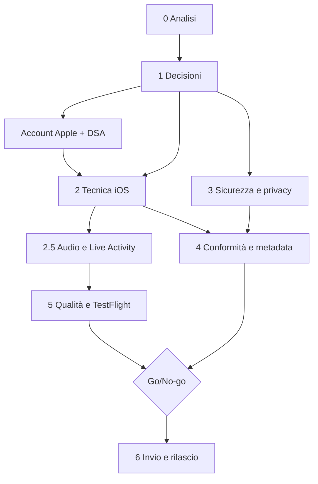

# Piano di lancio su App Store — Toji Workout

- **Data di redazione**: 2026-10-05
- **Stato**: BOZZA INIZIALE. Nessuna decisione presa, nessun codice iOS scritto, nessun account sviluppatore verificato. Il piano parte dalla sezione 1 (decisioni con l'utente).
- **Branch**: `claude/piano-lancio-appstore`
- **Collegato a**: [`PIANO.md`](PIANO.md) (Fase 5, rimandata), [`SICUREZZA.md`](SICUREZZA.md), [`ARCHITETTURA.md`](ARCHITETTURA.md)
- **Checklist operative**: [`checklist-appstore/`](checklist-appstore/README.md)

> Avvertenza di metodo. Le regole Apple cambiano spesso. Quello che questo documento marca "(da verificare, consultato 2026-10-05)" non è stato confermato su una pagina ufficiale integrale: va riletto alla fonte prima di decidere o inviare. Nulla qui è consulenza legale: GDPR, marchi e diritti di immagine vanno validati con un professionista.

## Come si aggiorna questo documento

1. Ogni modifica di stato va fatta nella checklist del tema (`- [ ]` diventa `- [x]`) e, se cambia una decisione, anche qui nella sezione interessata.
2. Quando una decisione della sezione 1 viene presa, scrivere sotto la domanda una riga `**Decisione (data): ...**` e spostare la raccomandazione in "Motivazione".
3. Quando si ricontrolla una regola Apple, sostituire "(da verificare, consultato 2026-10-05)" con "(verificato, AAAA-MM-GG)" e aggiornare l'Appendice A.
4. Aggiornare la riga "Stato" in testa e la tabella di stima (sezione 7) alla chiusura di ogni fase.
5. Dopo modifiche al codice, `npm run controlla` e, se il grafo è stale, `graphify update .` (vedi CLAUDE.md). Questo file è solo documentazione: non tocca il codice.
6. Un cambio di piano rilevante si annota in fondo, nel "Registro delle modifiche".

## Indice

- [0. Analisi dell'architettura attuale e cosa cambia con un wrapper nativo](#0-analisi-dellarchitettura-attuale-e-cosa-cambia-con-un-wrapper-nativo)
- [1. Decisioni preliminari con l'utente](#1-decisioni-preliminari-con-lutente)
- [2. Preparazione tecnica iOS](#2-preparazione-tecnica-ios)
- [3. Sicurezza e privacy](#3-sicurezza-e-privacy)
- [4. Conformità alle Review Guidelines](#4-conformità-alle-review-guidelines)
- [5. Qualità e test](#5-qualità-e-test)
- [6. Rilascio e dopo](#6-rilascio-e-dopo)
- [7. Stima, dipendenze e prossimi passi](#7-stima-dipendenze-e-prossimi-passi)
- [Appendice A. Fonti](#appendice-a-fonti)
- [Appendice B. Glossario](#appendice-b-glossario)

Checklist collegate: [01 Decisioni](checklist-appstore/01-decisioni.md) · [02 Tecnica iOS](checklist-appstore/02-tecnica-ios.md) · [03 Audio](checklist-appstore/03-audio.md) · [04 Sicurezza e privacy](checklist-appstore/04-sicurezza-privacy.md) · [05 Conformità e review](checklist-appstore/05-conformita-review.md) · [06 Qualità e test](checklist-appstore/06-qualita-test.md) · [07 Rilascio](checklist-appstore/07-rilascio.md)

Legenda responsabile: **U** = Utente, **C** = Claude, **U+C** = entrambi.

---

## 0. Analisi dell'architettura attuale e cosa cambia con un wrapper nativo

**Obiettivo.** Capire cosa funziona così com'è, cosa si rompe e cosa va aggiunto quando la PWA gira in una WKWebView (Capacitor) invece che in Safari/da schermata Home.

**Stato attuale in sintesi** (dall'analisi del repo, 2026-10-05): JavaScript ES5 vanilla, nessun build né bundler, script globali ordinati in `index.html`; 13 file CSS; `js/dati`, `js/coach` (motore a regole), `js/ui`, `js/core`. Nessun backend nel repo; Coach IA opzionale tramite un Worker Cloudflare. Nessun analytics. 25 file di test in `tests/` più `tests/browser`. Esiste già `js/core/nativo.js`, che rileva `window.Capacitor.isNativePlatform()` e prepara notifiche locali (id 7001), il plugin custom `RestTimerActivity` (Live Activity, NON incluso: la parte Swift va scritta) e le haptics con fallback `navigator.vibrate(200)`. Non esistono `capacitor.config.*` né la cartella `ios/`.

| Componente | Oggi (PWA) | In iOS nativo (WKWebView/Capacitor) | Azione |
|---|---|---|---|
| Distribuzione | URL + "Aggiungi a Home" | Binario firmato, App Store/TestFlight | Account sviluppatore, firma, ASC (sez. 1-2, 6) |
| Codice web | File statici serviti da HTTP | Copiati nel bundle app (`capacitor://localhost`) | Script di copia in `www/` (nessun build); la CSP va adattata |
| Service Worker `sw.js` (cache `3in-v10`, 143 asset) | Network-first con fallback offline | NON affidabile in WKWebView salvo App-Bound Domains (`WKAppBoundDomains`, max 10) e con problemi noti su localhost (issue Capacitor #4122) (da verificare, consultato 2026-10-05) | Non affidarsi al SW: in nativo i file sono già nel bundle. Disattivare/ignorare la registrazione quando `isNativePlatform()`. Aggiornamenti solo con nuova build |
| Manifest/icone | `manifest` standalone, icone 192/512, colori #08080a | Ignorato; servono AppIcon 1024 e launch screen | Creare icona 1024x1024 (senza alpha, da verificare), splash |
| Audio (bip, tick, fine, cedimento) | Web Audio via `getAudioCtx()`; `audio-silenzioso.js` con `SILENZIO_WAV`; MP3 utente in IndexedDB `tz_audio_db` | WKWebView usa la categoria AVAudioSession di default: può interrompere Spotify/podcast; comportamento con interruttore silenzioso da verificare | **Tema chiave.** Plugin nativo per AVAudioSession (sez. 2.5 e checklist 03) |
| Player YouTube/Spotify (`player-web.js`) | iframe, link validati da regex | iframe in WKWebView: ToS, cookie, errore 153/referrer da verificare | Test su dispositivo; valutare apertura esterna come fallback |
| Schermo acceso (`schermo-acceso.js`) | Wake Lock API | Supporto in WKWebView da verificare | Test; alternativa `@capacitor-community/keep-awake` |
| Vibrazione | `navigator.vibrate` (assente su iOS Safari) | `@capacitor/haptics` (già in `nativo.js`) | Verificare il percorso nativo, mantenere il fallback |
| Notifiche | Nessuna affidabile a app chiusa | `@capacitor/local-notifications` (id 7001, già previsto) | Permesso al momento giusto, test app chiusa/Basso consumo |
| Timer sul blocco schermo | Impossibile | Live Activity/Dynamic Island (`RestTimerActivity`, Swift da scrivere) | Widget extension + plugin custom (sez. 2.8) |
| Storage `localStorage` (`coach_plus_*`, `tz_*`, consensi, BIA) | Persistente salvo pulizia utente | Può essere sfrattato dall'OS (guida Capacitor storage); caso di dati azzerati in un upgrade 5 to 6 (issue #7548) (da verificare, consultato 2026-10-05) | Backup dei dati critici su Preferences/Filesystem, test di migrazione. NON rinominare `coach_plus_*`, `tz_*`, suffisso `_toji` |
| IndexedDB (MP3 `tz_audio_db`, foto progressi) | Persistente | Stessa fragilità; foto = permesso/Info.plist | Valutare Filesystem per file grandi, test di eviction |
| Import/export (JSON/CSV/ICS) | `<input type=file>` e download | Download via blob spesso non funziona in WKWebView | `@capacitor/share` + `@capacitor/filesystem` (sez. 2.10) |
| CSP in `index.html` | `script-src 'self' 'unsafe-inline' cdnjs/youtube/spotify`; `connect-src` Worker | Origine `capacitor://localhost`; serve controllare che nulla venga bloccato | Adattare e testare; piano per ridurre `unsafe-inline` (sez. 3) |
| Google Fonts / cdnjs (pdf.js con SRI, worker senza SRI) | Da CDN | Dipendenza di rete: peggiora offline e privacy | Includere localmente nel bundle (sez. 2.6, 3) |
| Coach IA (Worker Cloudflare) | `fetch` verso `coach-allenamento.avgolden1994.workers.dev` | Funziona se online; invia serie/carichi/RPE/livello | App Privacy labels; backend attivo e demo per la review (2.1) |
| Dark mode | `data-theme` | Va coordinata con tema di sistema e status bar | Test; `@capacitor/status-bar` |
| Safe area | `viewport-fit=cover` + `env(safe-area-inset-*)` | Già adatto, incluso Dynamic Island | Test su dispositivi con notch |
| i18n it/en/es/de | Dizionari nel codice | Uguale; servono anche i metadati ASC e i testi `Info.plist` localizzati | Localizzare metadati e usage strings |
| Test | `npm test`, `test:browser` (Chromium via playwright-core), `npm run controlla` | Nessuna copertura WebKit né del ponte nativo | Aggiungere (sez. 5) |

**Attività.**
1. Congelare questa analisi come baseline (U+C: C la aggiorna, U la valida).
2. Dopo il primo `npx cap add ios`, rifare la tabella con i risultati sul dispositivo reale (C).

**Responsabile.** C (analisi), U (conferma priorità).

**Criteri di uscita.** Tabella validata dall'utente; elenco dei punti "da verificare" trasformato in task nelle checklist.

**Rischi.** Dare per buone affermazioni non verificate (es. "il SW funziona in nativo" è SBAGLIATO; non c'è sync iCloud di localStorage). Il comportamento reale di audio e Wake Lock emerge solo su dispositivo.

---

## 1. Decisioni preliminari con l'utente

**Obiettivo.** Prendere le decisioni che condizionano tutto il resto, prima di scrivere codice iOS. Ogni domanda ha opzioni e una raccomandazione; la risposta va registrata in [checklist 01](checklist-appstore/01-decisioni.md).

**Responsabile.** U decide, C prepara le opzioni e documenta. **Criteri di uscita:** tutte le domande D1-D12 hanno una riga "Decisione (data)". **Rischi:** rimandare D5/D6/D7 (account e nome) blocca le settimane di attesa Apple (D-U-N-S, verifica identità).

### D1. Quale wrapper?
- **A. Capacitor 8 (raccomandato).** Riuso del 100% del web, `nativo.js` già pronto, plugin ufficiali, SPM di default, iOS 15 minimo, Xcode 26+ (https://ionic.io/blog/announcing-capacitor-8; versione 8.x esatta e compatibilità plugin da verificare, consultato 2026-10-05).
- **B. Swift nativo (SwiftUI) con WKWebView a mano.** Più controllo su audio e Live Activity, ma si rifà tutto il ponte e la manutenzione; utile solo se si vuole riscrivere l'app.
- **C. Restare PWA.** Zero costi e zero review, ma niente App Store, niente notifiche affidabili a schermo bloccato, niente Live Activity.
- Raccomandazione: **A**. La parte Swift resta circoscritta ai plugin custom (audio session, Live Activity).

### D2. Monetizzazione
- **A. Gratuita, senza acquisti (raccomandata per la v1).** Nessun impatto 3.1; la review è più semplice; i costi del Coach IA sono a carico dell'utente-sviluppatore.
- **B. Abbonamento.** Obbligo di In-App Purchase per sbloccare funzioni (3.1.1 In-App Purchase); gli abbonamenti (3.1.2 Subscriptions) devono avere durata minima di 7 giorni e valore continuativo (da verificare, consultato 2026-10-05). Commissione Apple da considerare.
- **C. Acquisto una tantum.** Sempre via IAP (3.1.1).
- Link a pagamenti esterni: 3.1.1(a) li ammette per gli USA; per UE/DMA esistono entitlement specifici (External Purchase Link Entitlement) con commissioni e condizioni (da verificare, consultato 2026-10-05). Non progettare la v1 su questi percorsi.
- Raccomandazione: **A** per il primo invio; rivalutare dopo il lancio, se il Coach IA ha un costo reale.

### D3. Account/cloud o solo locale?
Oggi: solo locale, Coach IA opzionale via Worker.
- **A. Solo locale + Coach IA opzionale (raccomandata).** Nessun login: evita 4.8 Login services e la cancellazione account 5.1.1(v); semplifica privacy.
- **B. Account e sync cloud.** Obbliga a cancellazione account in app (5.1.1(v)), eventuale Sign in with Apple (4.8, da verificare), e rende lo sviluppatore titolare dei dati (GDPR). Dati sanitari mai in iCloud (5.1.3).
- Raccomandazione: **A**. Valutare un backup/esportazione manuale come sostituto della sync.

### D4. Funzioni native da includere nella v1
Rispondere sì/no a ciascuna:
- Notifica a fine recupero (app chiusa): **sì, raccomandata** (valore nativo chiave, già in `nativo.js`).
- Live Activity/Dynamic Island per il timer: **sì, raccomandata** ma può slittare a v1.1 se pesa sul calendario.
- Haptics: **sì** (`@capacitor/haptics`, già previsto).
- Audio che convive con Spotify/podcast e in background: **sì** per la convivenza (plugin AVAudioSession); `UIBackgroundModes audio` solo se giustificato, vedi 2.5.4 (da verificare, consultato 2026-10-05).
- Apple Health/HealthKit: **no per la v1 (raccomandato).** Aggiunge 5.1.3, App Privacy, usage strings, e rischio di chiedere dati sanitari; il valore c'è (peso, BIA) ma va fatto dopo.
- Widget/Siri Shortcuts: rimandare, ma sono ottime contro il rischio 4.2.

### D5. Mercati e lingue
Raccomandazione: tutti i paesi dove è lecito, con localizzazione metadati in **it, en, es, de** (le lingue già in app). Decidere se escludere paesi per motivi legali/fiscali. Lingua primaria dell'App Store Connect: italiano o inglese (da decidere).

### D6. Account sviluppatore Apple
- 99 USD/anno (https://developer.apple.com/support/enrollment/).
- **Individuale**: nome legale come venditore; più rapido; il nome pubblico è il tuo nome.
- **Organizzazione**: richiede D-U-N-S, sito web, email di dominio; più lenta ma il venditore è la società. 5.1.1(ix) chiede entità legale per app in settori regolamentati (sanità): da verificare se si applica a un'app di allenamento non medicale (da verificare, consultato 2026-10-05).
- Raccomandazione: **individuale** per la v1 se non c'è società; passare a organizzazione solo se cresce.
- **DSA, status trader UE**: dichiarazione obbligatoria in App Store Connect; se "trader", indirizzo, telefono ed email vengono mostrati nello store UE. Decidere con il commercialista/legale se l'attività è professionale. Fonte: pagina Apple sul DSA (Appendice A).

### D7. Nome dell'app, marchi e bundle id
- Il nome ha un massimo di **30 caratteri** (2.3.7). Niente marchi altrui nelle keyword.
- **RISCHIO MARCHIO/IP da verificare**: "Toji" è il nome di un personaggio di Jujutsu Kaisen (Toji Fushiguro). Usarlo come nome o immagine dell'app può attirare un reclamo IP (5.2.1/5.2.5) e un rifiuto o una rimozione. Fare una ricerca marchi (UIBM/EUIPO/USPTO, Apple) e valutare un nome alternativo o un nome composto che non evochi il personaggio. Se l'icona o le grafiche richiamano il personaggio: no.
- Bundle id: formato DNS inverso, immutabile dopo la pubblicazione (es. `com.<tuonome>.tojiworkout`, esempio da confermare). Decidere prima di creare il progetto Xcode.
- Icona 1024x1024: decidere stile e fonte (vedi licenze in sez. 4).

### D8. iPad
- **A. Solo iPhone (raccomandata per la v1).** Meno screenshot (niente 13") e meno test.
- **B. Universale.** Richiede screenshot iPad 13" e un layout adatto (la UI è pensata per 390x844 e 360x640).
- Raccomandazione: **A**; impostare `TARGETED_DEVICE_FAMILY = 1`.

### D9. Privacy: Coach IA e App Privacy labels
Il Coach IA invia serie/carichi/RPE/livello al Worker: probabilmente NON si può dichiarare "Data Not Collected". Decidere: (a) dichiarare i dati inviati (Fitness/Other Usage Data, non collegati all'identità, non per tracking), dopo aver verificato che cosa il Worker conserva (aperto in PIANO.md Fase 4); (b) rendere il Coach IA solo locale nella build iOS. Raccomandazione: (a) con Worker che non conserva nulla, verificato e documentato. Dichiarare anche l'uso di AI di terzi in privacy policy (5.1.2) (da verificare, consultato 2026-10-05).

### D10. Titolare del trattamento e privacy policy
Chi pubblica la privacy policy e a quale URL pubblico (obbligatorio, 5.1.1(i), anche nell'app). Raccomandazione: pagina statica su dominio proprio, in it/en/es/de.

### D11. Contenuti di terzi
Decidere se tenere player YouTube/Spotify incorporati, "schede epoca d'oro" con nomi di culturisti reali, anteprime YouTube. Raccomandazione: tenere i link ma verificare ToS e diritti (sez. 4); usare formulazioni neutre ("ispirato a") ed evitare foto/nomi in marketing e icona.

### D12. Soglia go/no-go e tempi
Quante settimane investire e quale livello di rischio si accetta sul rifiuto della prima review. Raccomandazione: puntare a TestFlight esterno entro 6-8 settimane dall'avvio, store entro 10-12 (sez. 7).

---

## 2. Preparazione tecnica iOS

**Obiettivo.** Avere una build iOS firmata che gira su dispositivo, installabile da TestFlight, con audio, notifiche, haptics e storage verificati.

**Responsabile.** C (codice, script, plugin, test); U (account, firma, dispositivi, upload). **Criteri di uscita:** build su TestFlight interno che supera la checklist [02](checklist-appstore/02-tecnica-ios.md) e [03](checklist-appstore/03-audio.md). **Rischi generali:** Swift per i plugin custom (competenza e tempo), differenze WKWebView/Safari scoperte tardi, firma e provisioning che fanno perdere giorni.

### 2.1 Requisiti e progetto
- Dal 28/04/2026 gli invii richiedono Xcode 26 e SDK iOS 26 (https://developer.apple.com/news/upcoming-requirements/); la voce "9 settembre 2026 target iOS 13" vista nelle ricerche è dubbia (da verificare, consultato 2026-10-05). Già oggi (2026-10-05) la regola è in vigore: serve un Mac con Xcode 26.
- Capacitor 8: iOS minimo 15, Swift Package Manager come default (da verificare la 8.x esatta, consultato 2026-10-05). Deployment target iOS 15 (decisione utente: possibile alzarlo per ridurre test).
- `npm i @capacitor/core @capacitor/cli @capacitor/ios`, `npx cap init`, `npx cap add ios`. Creare `capacitor.config.ts` con `appId`, `appName`, `webDir: "www"`.

### 2.2 Struttura web dir
Nessun build. Aggiungere uno script `tools/prepara-www.js` (C) che copia in `www/` `index.html`, `css/`, `js/`, `esercizi/`, icone, manifest, font e librerie locali, escludendo `tests/`, `docs/`, `node_modules/`. `www/` è un artefatto: va in `.gitignore` oppure versionato per decisione, ma generato sempre dallo script prima di `npx cap sync`. Lo script va coperto da un test (l'elenco deve combaciare con `index.html`).

### 2.3 Firma, certificati, provisioning
Account sviluppatore attivo (D6), Apple ID, Team in Xcode, "Automatically manage signing", bundle id registrato. Capability da abilitare solo se servono: Push (non servono per notifiche locali), Background Modes (solo se giustificato), App Groups (Live Activity). U esegue; C scrive la guida passo-passo nella checklist.

### 2.4 Build e TestFlight
`npm run controlla`, `node tools/prepara-www.js`, `npx cap sync ios`, Archive in Xcode, upload ad App Store Connect, invio a TestFlight (sez. 5.5). Numero versione e build crescenti (sez. 6).

### 2.5 Audio session (TEMA CHIAVE)
**Problema.** Bip, tick, fine recupero e cedimento sono generati via Web Audio. In WKWebView la sessione audio usa la categoria di default dell'app: avviare un suono può interrompere Spotify o un podcast in riproduzione, e il suono può essere silenziato dall'interruttore laterale. Comportamento esatto su iOS 15-26 da verificare su dispositivo (da verificare, consultato 2026-10-05).

**Soluzione proposta.**
1. Plugin Capacitor custom (Swift, `TojiAudioSession` o simile) che imposti `AVAudioSession` con categoria `.playback` (se si vuole che i bip suonino anche con interruttore silenzioso) oppure `.ambient` (rispetta il silenzioso), con opzione `.mixWithOthers` per convivere con Spotify; `.duckOthers` per abbassare momentaneamente la musica durante il bip di cedimento. Scelta di prodotto: i bip devono suonare in silenzioso? Raccomandazione: `.playback` + `.mixWithOthers` + `.duckOthers` solo per gli avvisi brevi, con opzione utente.
2. Attivazione/disattivazione della sessione per evento (`setActive(true)` prima del bip, `setActive(false, options: .notifyOthersOnDeactivation)` dopo) in modo da non tenere "occupato" l'audio di Spotify.
3. Gestire interruzioni (chiamata, Siri) e cambio di rotta (cuffie Bluetooth, scollegamento).
4. `UIBackgroundModes` con `audio` SOLO se serve davvero far suonare a schermo bloccato; Apple lo concede per scopi previsti (2.5.4) e un uso non giustificato è motivo di rifiuto (testo esatto da verificare, consultato 2026-10-05). Alternativa: a schermo bloccato usare le notifiche locali con suono, che non richiedono background audio.
5. L'`audio-silenzioso.js` (`SILENZIO_WAV`) è un trucco per tenere sbloccato il contesto audio: in nativo va rivalutato, potrebbe essere superfluo o dannoso (mantiene la sessione attiva).
6. Provare MP3 utente in IndexedDB (`tz_audio_db`) e i player iframe: l'audio degli iframe YouTube/Spotify segue la sessione di sistema e può confliggere.
Prove: [checklist 03](checklist-appstore/03-audio.md).

### 2.6 Librerie e font locali
Includere Google Fonts e pdf.js (con relativo worker) nel bundle: più privacy (niente richieste a terzi, v. 3), funziona offline, e si può stringere la CSP. Verificare le licenze dei font (OFL) e mantenere i SRI ove si resta su CDN.

### 2.7 Schermo acceso
La Wake Lock API in WKWebView: supporto da verificare (da verificare, consultato 2026-10-05). Piano: test su iOS 15 minimo e 26; fallback `@capacitor-community/keep-awake` (plugin community, verificare compatibilità con Capacitor 8). Ripristinare lo stato a fine seduta.

### 2.8 Vibrazione, notifiche locali, Live Activity
- `navigator.vibrate` non esiste su iOS: usare `@capacitor/haptics` (già in `nativo.js`, impatto HEAVY).
- Notifiche locali: già previste, id 7001. Chiedere il permesso in un momento significativo (5.1.1(iv): non obbligare), testi localizzati, annullamento a fine/skip del recupero, comportamento in Basso consumo e Focus.
- **Live Activity `RestTimerActivity`**: plugin custom Swift + Widget Extension (ActivityKit), `NSSupportsLiveActivities` in Info.plist; stato timer con `Text(timerInterval:)` per non aggiornare di continuo. Da scrivere (C), testare su dispositivo reale (non sul simulatore per alcune parti). Non imitare la UI Apple (5.2.5).

### 2.9 Storage
`localStorage` e IndexedDB in WKWebView possono essere sfrattati dall'OS in condizioni di memoria o dopo certi upgrade (https://capacitorjs.com/docs/guides/storage; issue #7548). Piano: (1) copia di sicurezza dei dati critici (programma, storico, consensi, BIA) su `@capacitor/preferences` o file in `Filesystem` ad ogni salvataggio importante; (2) all'avvio, se `localStorage` è vuoto e il backup esiste, ripristino; (3) NON rinominare le chiavi `coach_plus_*`, `tz_*` e il suffisso `_toji`; (4) test di migrazione (sez. 5). Attenzione: il backup esistente non ripristina i consensi, mantenere questo comportamento voluto.

### 2.10 Import/export e condivisione
`<input type=file>` funziona di norma in WKWebView, il download via blob/anchor in genere no. Usare `@capacitor/filesystem` per scrivere in cache e `@capacitor/share` per il foglio di condivisione (JSON/CSV/ICS). Per le foto progressi: permesso foto con usage string (sez. 3).

### 2.11 Prestazioni, accessibilità, aspetto
- Prestazioni: misurare l'avvio a freddo su iPhone SE 3a gen; precaricare gli asset; ridurre il peso di `esercizi/`.
- Accessibilità: VoiceOver (etichette, ordine di focus), Dynamic Type (testi che non troncano), contrasto, riduzione movimento. Un test manuale dedicato.
- Dark mode: sincronizzare `data-theme` con `prefers-color-scheme` e con status bar (`@capacitor/status-bar`).
- Safe area: già `viewport-fit=cover` + `env()`; verificare con Dynamic Island e home indicator.
- iPad: vedi D8. Se solo iPhone, escludere iPad dal target.
- Status bar e splash: `@capacitor/status-bar`, `@capacitor/splash-screen` (launch screen in Xcode, colore #08080a).

---

## 3. Sicurezza e privacy

**Obiettivo.** Arrivare all'invio con rischio privacy e sicurezza noto, documentato e ridotto; allineare policy, App Privacy e comportamento reale. **Responsabile:** C (prove tecniche, codice), U (policy, decisioni legali, consulenza). **Criteri di uscita:** [checklist 04](checklist-appstore/04-sicurezza-privacy.md) completata, privacy policy online, App Privacy compilata, manifest presente. **Rischi:** dichiarazioni non coerenti con i flussi reali (rifiuto 5.1.1 o contestazione GDPR); dati sanitari trattati senza base giuridica.

### 3.1 Piano di prove OWASP MASVS v2 / MASTG
Fonte: https://mas.owasp.org/MASVS/ (non raggiunta nella ricerca: gruppi e controlli da verificare, consultato 2026-10-05).

| Gruppo | Applicabile? | Prove concrete |
|---|---|---|
| MASVS-STORAGE | Sì, alta | `localStorage`/IndexedDB contengono BIA (peso, altezza, massa grassa/magra, ECW, TBW, BMR) in chiaro; verificare che nessun dato finisca in log, in backup non voluti, in cache, in screenshot dello switcher. Valutare Keychain/cifratura per i dati BIA e per eventuali token. Controllare i file nel container (`Library`, `Documents`) dopo un uso tipico |
| MASVS-CRYPTO | Limitata | Nessuna crittografia propria: se si cifra, usare API di sistema (CryptoKit/WebCrypto), mai algoritmi fatti in casa. Export compliance: solo HTTPS, `ITSAppUsesNonExemptEncryption=false` |
| MASVS-AUTH | Non applicabile (nessun account) | Documentare che non c'è autenticazione; se in futuro si aggiunge, rivedere |
| MASVS-NETWORK | Sì | Solo HTTPS (ATS di default); `connect-src` limitato al Worker; verificare che Coach IA usi TLS valido; valutare certificate pinning (probabilmente sproporzionato). Provare con proxy (mitmproxy) che nessun dato extra esca |
| MASVS-PLATFORM | Sì, alta | WebView: no `allowsInlineMediaPlayback` inutili, nessun bridge esposto oltre i plugin necessari, `limitsNavigationsToAppBoundDomains` valutato, schemi URL/deep link assenti o validati, `target=_blank` verso Safari, iframe YouTube/Spotify isolati. Test su XSS (3.2) e su apertura di URL arbitrari |
| MASVS-CODE | Sì | `npm audit`, aggiornamenti Capacitor/plugin, nessun codice scaricato dopo l'installazione (2.5.2), scansione segreti nel repo (gitleaks o simile) e nella history, build di release senza `debuggable` / `webContentsDebuggingEnabled` |
| MASVS-RESILIENCE | Bassa priorità | App non critica: niente jailbreak detection. Verificare solo che l'app non esponga debug in release |
| MASVS-PRIVACY | Sì, alta | Minimizzazione dati, trasparenza, controllo utente (cancella tutto, esporta), coerenza con App Privacy, nessun tracking |

### 3.2 Dati sul dispositivo, import e XSS
- BIA in chiaro in `localStorage`: definire se accettabile (dati solo locali, sul dispositivo dell'utente) oppure migrare in Keychain/Preferences cifrate. Raccomandazione: accettare per la v1 dopo documentazione, ma valutare la migrazione (rischio proporzionato: nessun account, nessun cloud).
- Import CSV/JSON: difese esistenti `nomeSicuro`, `jsArg`, `pulisciDeep`. Aggiungere test con payload XSS in tutti i campi importati (nomi esercizi, note, link) e in ogni punto di render `innerHTML`.
- CSP: oggi `script-src 'self' 'unsafe-inline'` + cdnjs/youtube/spotify. Piano per ridurlo: (1) spostare gli script inline in file; (2) rimuovere gli handler `onclick=` inline a favore di `addEventListener`; (3) usare hash/nonce se serve; (4) in nativo, includere pdf.js localmente e togliere cdnjs. Attenzione: in nativo l'origine è `capacitor://localhost` e il `connect-src` deve restare per il Worker Cloudflare; testare ogni schermata dopo le modifiche.
- Limiti già noti in [`SICUREZZA.md`](SICUREZZA.md): `unsafe-inline`, dati in chiaro, worker pdf.js senza SRI, servizi video esterni.

### 3.3 Servizi esterni
- **YouTube/Spotify iframe**: ricevono l'IP dell'utente e possono impostare cookie; ToS e policy dei servizi da leggere; in WKWebView l'embed può dare "errore 153"/problemi di referrer (con `referrer no-referrer` presente nella pagina) (da verificare, consultato 2026-10-05). Valutare: lasciare il player, caricarlo solo dopo un click esplicito, oppure aprire in Safari/app YouTube. Informare nella privacy policy.
- **Google Fonts/cdnjs**: includerli localmente in nativo (privacy e offline).
- Nessun analytics e nessun SDK terzo: mantenere così per non cambiare le label.

### 3.4 Permessi e Info.plist
Usage strings localizzate (it/en/es/de) solo per ciò che serve davvero: foto progressi (`NSPhotoLibraryUsageDescription`/`NSCameraUsageDescription` se si usa la fotocamera), notifiche (nessuna usage string, solo richiesta di sistema), HealthKit (`NSHealthShareUsageDescription`/`NSHealthUpdateUsageDescription`) solo se D4=sì. Chiedere i permessi al momento d'uso e non obbligare (5.1.1(iii)-(iv)). L'app deve funzionare anche se rifiutati.

### 3.5 Backup, esportazione, cancellazione, minori
- Pulsante "cancella tutto" (localStorage, IndexedDB, backup Preferences/Filesystem, notifiche pianificate, Live Activity). Se non ci sono account, 5.1.1(v) non si applica, ma la cancellazione dati è buona pratica e GDPR.
- Esportazione già presente (JSON/CSV/ICS): verificare che includa i dati sanitari su richiesta.
- Minori: l'app non è per bambini (non Kids Category, 1.3/5.1.4); valutare età minima e il testo del consenso; il questionario età (sez. 4) va compilato coerentemente.

### 3.6 Privacy policy, App Privacy labels, Privacy Manifest
- **Privacy policy** a URL pubblico in App Store Connect e raggiungibile in app (5.1.1(i)). Deve descrivere dati raccolti, Coach IA, servizi di terzi (YouTube/Spotify/Cloudflare), conservazione, diritti GDPR, contatti.
- **App Privacy labels** (nutrition labels): obbligatorie; pagina d'aiuto non raggiunta (da verificare, consultato 2026-10-05). Probabile dichiarazione: dati inviati al Worker (fitness/uso) non collegati all'identità, non per tracking; eventuale "Data Not Collected" solo se il Coach IA viene reso locale o non conserva nulla e Apple lo considera tale (decidere D9).
- **Privacy Manifest `PrivacyInfo.xcprivacy`**: obbligatorio per le "required reason APIs" dal 1/5/2024 (https://developer.apple.com/documentation/bundleresources/describing-use-of-required-reason-api). `UserDefaults` richiede il motivo `CA92.1`; verificare se Capacitor e i plugin includono già un proprio manifest e se serve quello dell'app (da verificare, consultato 2026-10-05). `NSPrivacyTracking=false`.
- **ATT** (App Tracking Transparency): non necessario senza tracking (5.1.2).
- **GDPR art. 9**: il BIA è dato relativo alla salute; base giuridica consenso esplicito art. 9(2)(a), già presente in app (`tz_consenso`, `tz_consenso_ia`) con informativa in 4 lingue. Con app solo locale, lo sviluppatore in genere non è titolare di quei dati, ma lo diventa con Coach IA, analytics o cloud (da verificare con un legale, consultato 2026-10-05).
- **1.4.1 e 5.1.3**: nessuna promessa medica; disclaimer; nessun dato sanitario in iCloud; nessuna pubblicità basata su dati di salute; se HealthKit, niente dati falsi.

---

## 4. Conformità alle Review Guidelines

**Obiettivo.** Ridurre al minimo la probabilità di rifiuto e preparare materiali e risposte. Riferimento: https://developer.apple.com/app-store/review/guidelines/ (data dell'ultimo aggiornamento non verificata; numerazione da ricontrollare, consultato 2026-10-05). **Responsabile:** U+C (C prepara testi e prove, U valida le dichiarazioni legali e carica su ASC). **Criteri di uscita:** [checklist 05](checklist-appstore/05-conformita-review.md) completata. **Rischi:** 4.2 e 4.3 (app percepita come sito impacchettato o in categoria satura), nome/IP, privacy incoerente.

### 4.1 Funzionalità e valore nativo (4.2 Minimum Functionality, 4.2.2)
Una "web clipping" o un sito impacchettato è a rischio rifiuto. Elencare nella nota al revisore e in app valore nativo concreto:
- notifica di fine recupero ad app chiusa;
- Live Activity/Dynamic Island per il timer;
- haptics;
- audio che convive con Spotify/podcast (AVAudioSession);
- uso completo offline (file nel bundle, nessuna dipendenza da CDN);
- condivisione ed esportazione native (Share sheet, Filesystem);
- opzionali: HealthKit, widget, Siri Shortcuts (App Intents).
Appoggiarsi anche al fatto che l'app ha un motore di coaching a regole proprio, non un semplice sito.

### 4.2 Spam e saturazione (4.3)
Timer/fitness sono categorie piene (i timer sono citati tra le categorie sature, da verificare). Differenziatori da evidenziare: coach a regole con struttura professionale e intensità dal corpo (BIA), schede "epoca d'oro", tutto locale e senza account, multilingua it/en/es/de. Evitare copie di template o di altre app.

### 4.3 Completezza (2.1)
Il Coach IA deve funzionare durante la review: backend (Worker Cloudflare) attivo, e se serve un account o un codice, fornire demo nelle note. Nessun placeholder, nessun link rotto, nessuna schermata vuota senza rete.

### 4.4 Metadata e screenshot (2.3)
- 2.3.3: screenshot che mostrino l'app in uso reale. 2.3.6: fascia d'età onesta. 2.3.7: nome max 30 caratteri, niente marchi altrui in keyword. 2.3.9: diritti su tutti i materiali.
- Screenshot: da 1 a 10 per dimensione, JPG/PNG senza alpha. iPhone 6.9" obbligatorio (risoluzioni esatte da verificare sulla pagina: https://developer.apple.com/help/app-store-connect/reference/app-information/screenshot-specifications, consultato 2026-10-05); 6.5" 1284x2778 se mancano i 6.9"; se l'app gira su iPad, anche 13" (2064x2752 o 2048x2732, da verificare).
- Localizzare nome, sottotitolo, descrizione, keyword, screenshot in **it, en, es, de**.

### 4.5 Salute e sicurezza (1.4.1) e 5.1.3
Disclaimer visibile: l'app non è un dispositivo medico, non sostituisce il medico. Il BIA e le segnalazioni di "prudenza" sono scrutinati: niente diagnosi o promesse di salute. Citare i limiti nella descrizione e in app. 5.1.3 se HealthKit.

### 4.6 Licenze contenuti e diritti
- **Disegni SVG in `esercizi/`**: l'analisi del repo dice che NON sono generati da Quiver. Il brief iniziale però cita immagini Quiver.ai Arrow 2: **verificare quali asset sono realmente generati e i termini di licenza di Quiver per uso commerciale** (da verificare, consultato 2026-10-05). Tenere un registro asset, autore, licenza.
- **YouTube e anteprime**: link e thumbnail di terzi: 5.2.2 (third-party sites/services) e 5.2.3 (no download/salvataggio di contenuti da servizi tipo YouTube/Spotify, da verificare); rispettare le API ToS.
- **"Schede epoca d'oro"** con nomi di culturisti reali (Reg Park, Arnold, Gironda, Reeves, Yates, Mentzer...): diritti di nome/immagine e di marchio (5.2.1) da verificare; usare i nomi come riferimento storico descrittivo, senza foto né logo, senza suggerire approvazione.
- **5.2.5**: non imitare UI Apple (Activity rings, icone Health).
- **Nome/marchi (5.2)**: vedi D7, rischio "Toji".

### 4.7 Pagamenti (3.1)
Se gratuita, nessun IAP e nessun link a pagamenti. Altrimenti 3.1.1, 3.1.2, 3.1.1(a) come in D2.

### 4.8 Età
Nuovo questionario (4+, 9+, 13+, 16+, 18+; aggiornato entro 31/01/2026, da verificare: https://developer.apple.com/help/app-store-connect/reference/app-information/age-ratings-values-and-definitions). Una WebView con navigazione libera o contenuti medici può alzare la fascia. Rispondere in modo veritiero (2.3.6) e rivedere dopo ogni feature.

### 4.9 Altri adempimenti
- **Export compliance**: `ITSAppUsesNonExemptEncryption=false` se si usa solo HTTPS (https://developer.apple.com/documentation/security/complying-with-encryption-export-regulations).
- **DSA trader**: status in ASC (D6).
- **4.8 Login services**: non applicabile senza login.
- **1.3 Kids Category/5.1.4**: non si punta ai bambini.
- URL di supporto obbligatorio.

---

## 5. Qualità e test

**Obiettivo.** Provare che l'app funziona su dispositivi reali, nelle condizioni difficili, e fissare criteri go/no-go. **Responsabile:** C (automazione), U (dispositivi, test manuali, tester). **Criteri di uscita:** [checklist 06](checklist-appstore/06-qualita-test.md) e [03](checklist-appstore/03-audio.md) a posto; go/no-go firmato. **Rischi:** pochi dispositivi, test audio solo sul simulatore (non basta), bug scoperti dal revisore.

### 5.1 Matrice di test
| Asse | Valori |
|---|---|
| Dispositivi | iPhone SE 3a gen (schermo piccolo, iOS minimo supportato), iPhone 13/15/17 su iOS 26, iPad solo se supportato (D8) |
| Audio | con e senza Spotify/podcast in riproduzione; cuffie Bluetooth; chiamata in arrivo |
| Modalità | silenzioso ON/OFF; Basso consumo; schermo bloccato; app in background; Focus attivo |
| Rete | online, offline, rete lenta (Coach IA) |
| Lingua | it, en, es, de |
| Tema | chiaro/scuro; Dynamic Type grande; VoiceOver |

### 5.2 Test automatici esistenti
`npm test`, `npm run test:browser` (Chromium con playwright-core), `npm run controlla` (sw + catalogo + indice + test); 25 file in `tests/`. Eseguire prima di ogni build.

### 5.3 Test mancanti da aggiungere (C)
1. **WebKit**: `playwright webkit` per intercettare differenze Safari (Web Audio, Wake Lock, vibrate, CSP).
2. **Ponte nativo**: test con mock di `window.Capacitor` per `nativo.js` (notifiche, haptics, Live Activity, fallback).
3. **Migrazione storage**: test che simulano `localStorage` svuotato e ripristino dal backup, e che verificano che `coach_plus_*`, `tz_*`, `_toji` non cambino.
4. **XCUITest smoke**: avvio, primo allenamento, timer, notifica.
5. Test dello script `prepara-www.js` (elenco file completo) e della CSP in nativo.

### 5.4 Checklist manuali audio
Non esiste una checklist audio nei docs attuali (verificato con ricerca nei file di `docs/`, 2026-10-05): è scritta in [checklist-appstore/03-audio.md](checklist-appstore/03-audio.md).

### 5.5 Beta TestFlight
Fino a 100 tester interni; fino a 10.000 esterni con Beta App Review per la prima build esterna; le build scadono dopo 90 giorni (https://developer.apple.com/help/app-store-connect/test-a-beta-version/testflight-overview). Raccogliere feedback strutturato (modulo + crash dall'Organizer).

### 5.6 Criteri go/no-go
GO se: tutti i test automatici verdi; checklist audio senza bug bloccanti; zero crash su 7 giorni di beta interna; permessi e privacy coerenti; screenshot e metadata pronti; nessun asset senza licenza; nome/marchio verificato. NO-GO se: Spotify interrotto dai bip, perdita di dati in migrazione, nota di revisione non convincente, rischio IP aperto.

---

## 6. Rilascio e dopo

**Obiettivo.** Inviare, gestire la review, rilasciare con cautela e mantenere. **Responsabile:** U (invio, ASC, risposte) con C (testi, correzioni, hotfix). **Criteri di uscita:** app "Pronta per la vendita", monitoraggio attivo, piano aggiornamenti. **Rischi:** rifiuti ripetuti, hotfix senza rollback, recensioni negative per bug audio.

### 6.1 Invio
Compilare ASC (metadati 4 lingue, screenshot, privacy URL, App Privacy, età, export, DSA, supporto), selezionare la build, inviare in revisione. La revisione si conclude in genere entro 24-48 h per circa il 90% dei casi (da verificare, consultato 2026-10-05).

### 6.2 Note per il revisore
Spiegare in modo sintetico: nessun login; funzioni native (notifica a fine recupero, Live Activity, haptics, audio che convive con altre app); come provare il Coach IA (backend attivo); dove si trova il disclaimer medico; origine dei contenuti (disegni, schede storiche); nessun acquisto. Allegare un breve video su dispositivo.

### 6.3 Rifiuti
Rispondere nel Resolution Center, citando la guideline contestata e cosa è cambiato; correggere e reinviare; per decisioni ritenute errate, appeal (App Review Board). Tenere un registro dei rifiuti.

### 6.4 Rilascio
Rilascio manuale dopo l'approvazione; **phased release** su 7 giorni (pausa fino a 30 giorni, da verificare, consultato 2026-10-05) per intercettare problemi.

### 6.5 Monitoraggio
Crash e metriche da Xcode Organizer e App Store Connect; nessun SDK terzo (non cambia le label). Raccogliere feedback via email di supporto e TestFlight.

### 6.6 Recensioni e aggiornamenti
Rispondere alle recensioni; cadenza suggerita: correzioni ogni 2-4 settimane nei primi mesi. Versione (`CFBundleShortVersionString`, es. 1.0.0) e build (`CFBundleVersion`, intero crescente per ogni upload).

### 6.7 Rollback
Non esiste un rollback vero: si può rimuovere dalla vendita o pubblicare un hotfix con review accelerata (expedited review, da richiedere con motivazione). Tenere sempre pronta una build precedente stabile da reinviare e una flag per disattivare funzioni nuove (senza scaricare codice, 2.5.2).

### 6.8 Supporto
URL di supporto obbligatorio, email di contatto, FAQ; tempi di risposta indicativi.

---

## 7. Stima, dipendenze e prossimi passi

### 7.1 Stima per fase (indicativa, settimane lavorative, un solo sviluppatore + Claude)
| Fase | Durata | Dipende da | Blocca |
|---|---|---|---|
| 0 Analisi | 0,5 | nessuna | 1 |
| 1 Decisioni | 1 (risposte utente) | 0 | tutto; D6/D7 sbloccano attese Apple |
| Account Apple (in parallelo) | 1-3 (verifica identità; D-U-N-S per organizzazione può richiedere di più) | D6 | 2.3 firma, upload |
| 2 Tecnica iOS (progetto, www, haptics, notifiche, storage) | 2-3 | 1, Xcode 26 | 5, 6 |
| 2.5 Audio session + Live Activity (Swift) | 2-3 | 2 progetto, dispositivo | go/no-go |
| 3 Sicurezza e privacy (prove, policy, manifest) | 2 (in parallelo con 2) | 1 (D9, D10) | 6.1 invio |
| 4 Conformità/metadata/screenshot | 1-2 | 1, build funzionante per screenshot | 6.1 |
| 5 Qualità e beta TestFlight | 2-3 (inclusa Beta App Review esterna) | 2, 3 | go/no-go |
| 6 Invio e review | 0,5-1 (review) + eventuali iterazioni 1-2 | tutte | rilascio |
| **Totale indicativo** | **10-14 settimane** dal via (circa 10-12 con un percorso senza intoppi) | | |

Cosa blocca cosa: senza D6/D7 non si crea il progetto firmato; senza D9/D10 non si scrivono policy e App Privacy; senza dispositivo reale non si chiude l'audio; senza nome verificato non si invia.

### 7.2 Prossimi 5 passi concreti
1. **U** risponde alle domande D1-D12 (priorità: D1 wrapper, D2 monetizzazione, D6 account, D7 nome/marchio, D8 iPad).
2. **U** avvia l'iscrizione all'Apple Developer Program (99 USD/anno) e la verifica identità; verifica il nome "Toji" con una ricerca marchi.
3. **C** crea `tools/prepara-www.js`, `capacitor.config.ts` e il progetto `ios/` con Capacitor 8 (dopo D1), con `npm run controlla` verde.
4. **C** scrive e **U** prova su iPhone il plugin audio session (checklist 03) con e senza Spotify.
5. **U+C** pubblicano la privacy policy (URL pubblico) e decidono D9 per le App Privacy labels.

---

## Registro delle modifiche
- 2026-10-05: prima stesura del piano e delle checklist.

---

## Appendice A. Fonti

Tutte consultate il 2026-10-05; molte pagine sono state lette tramite riassunto, quindi i punti incerti sono marcati "(da verificare)".

- App Store Review Guidelines: https://developer.apple.com/app-store/review/guidelines/ (sezioni 1.3, 1.4.1, 2.1, 2.3, 2.5.2, 2.5.4, 3.1, 4.2, 4.3, 4.8, 5.1.1, 5.1.2, 5.1.3, 5.1.4, 5.2)
- Requisiti futuri e Xcode/SDK: https://developer.apple.com/news/upcoming-requirements/
- Required reason APIs: https://developer.apple.com/documentation/bundleresources/describing-use-of-required-reason-api
- Screenshot: https://developer.apple.com/help/app-store-connect/reference/app-information/screenshot-specifications
- Fasce di età: https://developer.apple.com/help/app-store-connect/reference/app-information/age-ratings-values-and-definitions
- Export compliance: https://developer.apple.com/documentation/security/complying-with-encryption-export-regulations
- DSA trader: https://developer.apple.com/help/app-store-connect/manage-compliance-information/manage-european-union-digital-services-act-trader-requirements
- Iscrizione al programma: https://developer.apple.com/support/enrollment/
- TestFlight: https://developer.apple.com/help/app-store-connect/test-a-beta-version/testflight-overview
- Capacitor 8: https://ionic.io/blog/announcing-capacitor-8
- Capacitor storage: https://capacitorjs.com/docs/guides/storage
- Capacitor issue #4122 (SW e localhost), #7548 (dati azzerati 5 to 6): repository GitHub di Capacitor (da verificare)
- OWASP MASVS/MASTG: https://mas.owasp.org/ (non raggiunto: da verificare)
- App Privacy details (pagina d'aiuto 404 nella ricerca: da verificare)
- GDPR, art. 9: https://eur-lex.europa.eu/eli/reg/2016/679/oj

## Appendice B. Glossario
- **ASC**: App Store Connect.
- **ATT**: App Tracking Transparency.
- **ATS**: App Transport Security (HTTPS obbligatorio di default).
- **BIA**: bioimpedenziometria (peso, massa grassa/magra, ECW, TBW, BMR).
- **CSP**: Content Security Policy.
- **DMA**: Digital Markets Act (UE).
- **DSA**: Digital Services Act (UE), status "trader".
- **D-U-N-S**: identificativo aziendale richiesto per l'account organizzazione.
- **IAP**: In-App Purchase.
- **Live Activity**: attività sul blocco schermo/Dynamic Island (ActivityKit).
- **MASVS/MASTG**: standard e guida di test OWASP per la sicurezza mobile.
- **Privacy Manifest**: `PrivacyInfo.xcprivacy`.
- **SPM**: Swift Package Manager.
- **SW**: Service Worker.
- **WKWebView**: componente web di iOS usato da Capacitor.
