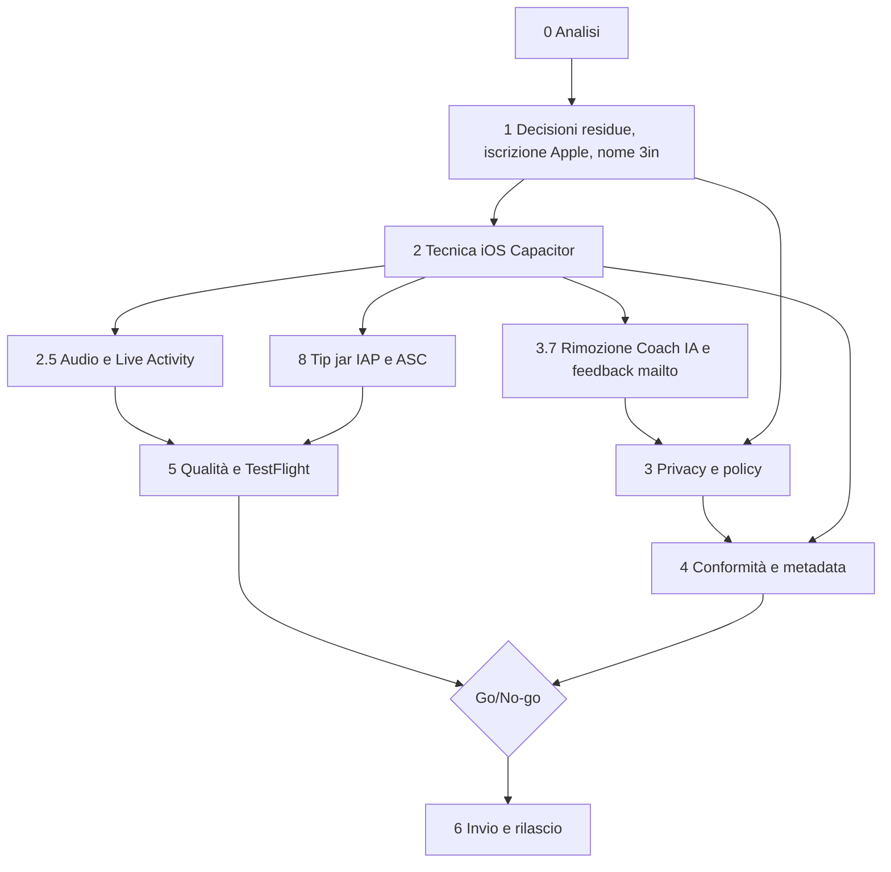

# Piano di lancio su App Store — 3in

- **Data di redazione**: 2026-10-05 (aggiornato lo stesso giorno con le decisioni dell'utente)
- **Stato**: **Decisioni principali prese il 2026-10-05** (D1-D3, D5-D11; restano aperte D4 funzioni native e D12 tempi/rischio). Nome app: "3in". Nessun codice iOS scritto, account Apple non ancora iscritto, nome non ancora verificato in App Store Connect né come marchio. Vedi sezione 1.
- **Branch**: `claude/piano-lancio-appstore`
- **Collegato a**: [`PIANO.md`](PIANO.md) (Fase 5, rimandata), [`SICUREZZA.md`](SICUREZZA.md), [`ARCHITETTURA.md`](ARCHITETTURA.md)
- **Checklist operative**: [`checklist-appstore/`](checklist-appstore/README.md)

> Avvertenza di metodo. Le regole Apple cambiano spesso. Quello che questo documento marca "(da verificare, consultato 2026-10-05)" non è stato confermato su una pagina ufficiale integrale: va riletto alla fonte prima di decidere o inviare. Nulla qui è consulenza legale: GDPR, marchi e diritti di immagine vanno validati con un professionista.

## Come si aggiorna questo documento

1. Ogni modifica di stato va fatta nella checklist del tema (`- [ ]` diventa `- [x]`) e, se cambia una decisione, anche qui nella sezione interessata.
2. Quando una decisione ancora aperta (sezione 1.2) viene presa, spostarla nella tabella 1.1 con la data e spuntarla in `checklist-appstore/01-decisioni.md`.
3. Quando si ricontrolla una regola Apple, sostituire "(da verificare, consultato 2026-10-05)" con "(verificato, AAAA-MM-GG)" e aggiornare l'Appendice A.
4. Aggiornare la riga "Stato" in testa e la tabella di stima (sezione 7) alla chiusura di ogni fase.
5. Dopo modifiche al codice, `npm run controlla` e, se il grafo è stale, `graphify update .` (vedi CLAUDE.md). Questo file è solo documentazione: non tocca il codice.
6. Un cambio di piano rilevante si annota in fondo, nel "Registro delle modifiche".

## Indice

- [0. Analisi dell'architettura attuale e cosa cambia con un wrapper nativo](#0-analisi-dellarchitettura-attuale-e-cosa-cambia-con-un-wrapper-nativo)
- [1. Decisioni prese e questioni aperte](#1-decisioni-prese-e-questioni-aperte)
- [2. Preparazione tecnica iOS](#2-preparazione-tecnica-ios)
- [3. Sicurezza e privacy](#3-sicurezza-e-privacy) (3.7 rimozione del Coach IA)
- [4. Conformità alle Review Guidelines](#4-conformità-alle-review-guidelines)
- [5. Qualità e test](#5-qualità-e-test)
- [6. Rilascio e dopo](#6-rilascio-e-dopo)
- [7. Stima, dipendenze e prossimi passi](#7-stima-dipendenze-e-prossimi-passi)
- [8. Monetizzazione e rientro dell'investimento](#8-monetizzazione-e-rientro-dellinvestimento)
- [9. Privacy in parole semplici](#9-privacy-in-parole-semplici)
- [Appendice A. Fonti](#appendice-a-fonti)
- [Appendice B. Glossario](#appendice-b-glossario)

Checklist collegate: [01 Decisioni](checklist-appstore/01-decisioni.md) · [02 Tecnica iOS](checklist-appstore/02-tecnica-ios.md) · [03 Audio](checklist-appstore/03-audio.md) · [04 Sicurezza e privacy](checklist-appstore/04-sicurezza-privacy.md) · [05 Conformità e review](checklist-appstore/05-conformita-review.md) · [06 Qualità e test](checklist-appstore/06-qualita-test.md) · [07 Rilascio](checklist-appstore/07-rilascio.md) · [08 Monetizzazione](checklist-appstore/08-monetizzazione.md)

Altri documenti: [`privacy-policy-bozza.md`](privacy-policy-bozza.md)

Legenda responsabile: **U** = Utente, **C** = Claude, **U+C** = entrambi.

---

## 0. Analisi dell'architettura attuale e cosa cambia con un wrapper nativo

**Obiettivo.** Capire cosa funziona così com'è, cosa si rompe e cosa va aggiunto quando la PWA gira in una WKWebView (Capacitor) invece che in Safari/da schermata Home.

**Stato attuale in sintesi** (dall'analisi del repo, 2026-10-05): JavaScript ES5 vanilla, nessun build né bundler, script globali ordinati in `index.html`; 13 file CSS; `js/dati`, `js/coach` (motore a regole), `js/ui`, `js/core`. Nessun backend nel repo; Coach IA opzionale tramite un Worker Cloudflare (da togliere nella build iOS v1, D9). Nessun analytics. 25 file di test in `tests/` più `tests/browser`. Esiste già `js/core/nativo.js`, che rileva `window.Capacitor.isNativePlatform()` e prepara notifiche locali (id 7001), il plugin custom `RestTimerActivity` (Live Activity, NON incluso: la parte Swift va scritta) e le haptics con fallback `navigator.vibrate(200)`. Non esistono `capacitor.config.*` né la cartella `ios/`.

| Componente | Oggi (PWA) | In iOS nativo (WKWebView/Capacitor) | Azione |
|---|---|---|---|
| Distribuzione | URL + "Aggiungi a Home" | Binario firmato, App Store/TestFlight | Account sviluppatore, firma, ASC (sez. 1-2, 6) |
| Codice web | File statici serviti da HTTP | Copiati nel bundle app (`capacitor://localhost`) | Script di copia in `www/` (nessun build); la CSP va adattata |
| Service Worker `sw.js` (cache `3in-v10`, 143 asset) | Network-first con fallback offline | NON affidabile in WKWebView salvo App-Bound Domains (`WKAppBoundDomains`, max 10) e con problemi noti su localhost (issue Capacitor #4122) (da verificare, consultato 2026-10-05) | Non affidarsi al SW: in nativo i file sono già nel bundle. Disattivare/ignorare la registrazione quando `isNativePlatform()`. Aggiornamenti solo con nuova build |
| Manifest/icone | `manifest` standalone, icone 192/512, colori #08080a | Ignorato; servono AppIcon 1024 e launch screen | Creare icona 1024x1024 (senza alpha, da verificare), splash |
| Audio (bip, tick, fine, cedimento) | Web Audio via `getAudioCtx()`; `audio-silenzioso.js` con `SILENZIO_WAV`; MP3 utente in IndexedDB `tz_audio_db` | WKWebView usa la categoria AVAudioSession di default: può interrompere Spotify/podcast; comportamento con interruttore silenzioso da verificare | **Tema chiave.** Plugin nativo per AVAudioSession (sez. 2.5 e checklist 03) |
| Player YouTube/Spotify (`player-web.js`) | iframe, link validati da regex | iframe in WKWebView: ToS, cookie, errore 153/referrer da verificare | Test su dispositivo; valutare apertura esterna come fallback |
| Schermo acceso (`schermo-acceso.js`) | Wake Lock API | Supporto in WKWebView da verificare | Test; alternativa `@capacitor-community/keep-awake` |
| Vibrazione | `navigator.vibrate` (assente su iOS Safari) | `@capacitor/haptics` (già in `nativo.js`) | Verificare il percorso nativo, mantenere il fallback |
| Notifiche | Nessuna affidabile a app chiusa | `@capacitor/local-notifications` (id 7001, già previsto) | Permesso al momento giusto, test app chiusa/Basso consumo |
| Timer sul blocco schermo | Impossibile | Live Activity/Dynamic Island (`RestTimerActivity`, Swift da scrivere) | Widget extension + plugin custom (sez. 2.8) |
| Storage `localStorage` (`coach_plus_*`, `tz_*`, consensi, BIA) | Persistente salvo pulizia utente | Può essere sfrattato dall'OS (guida Capacitor storage); caso di dati azzerati in un upgrade 5 to 6 (issue #7548) (da verificare, consultato 2026-10-05) | Backup dei dati critici su Preferences/Filesystem, test di migrazione. NON rinominare `coach_plus_*`, `tz_*`, suffisso `_toji` |
| IndexedDB (MP3 `tz_audio_db`, foto progressi) | Persistente | Stessa fragilità; foto = permesso/Info.plist | Valutare Filesystem per file grandi, test di eviction |
| Import/export (JSON/CSV/ICS) | `<input type=file>` e download | Download via blob spesso non funziona in WKWebView | `@capacitor/share` + `@capacitor/filesystem` (sez. 2.10) |
| CSP in `index.html` | `script-src 'self' 'unsafe-inline' cdnjs/youtube/spotify`; `connect-src` Worker | Origine `capacitor://localhost`; serve controllare che nulla venga bloccato | Adattare e testare; piano per ridurre `unsafe-inline` (sez. 3) |
| Google Fonts / cdnjs (pdf.js con SRI, worker senza SRI) | Da CDN | Dipendenza di rete: peggiora offline e privacy | Includere localmente nel bundle (sez. 2.6, 3) |
| Coach IA (Worker Cloudflare) | `fetch` verso `coach-allenamento.avgolden1994.workers.dev`; invia serie/carichi/RPE/livello | **Decisione D9: tolto o disattivato con flag nella build iOS v1** | Punti di codice in 3.7; niente App Privacy per dati inviati, niente demo 2.1 |
| Dark mode | `data-theme` | Va coordinata con tema di sistema e status bar | Test; `@capacitor/status-bar` |
| Safe area | `viewport-fit=cover` + `env(safe-area-inset-*)` | Già adatto, incluso Dynamic Island | Test su dispositivi con notch |
| i18n it/en/es/de | Dizionari nel codice | Uguale; servono anche i metadati ASC e i testi `Info.plist` localizzati | Localizzare metadati e usage strings |
| Test | `npm test`, `test:browser` (Chromium via playwright-core), `npm run controlla` | Nessuna copertura WebKit né del ponte nativo | Aggiungere (sez. 5) |

**Attività.**
1. Congelare questa analisi come baseline (U+C: C la aggiorna, U la valida).
2. Dopo il primo `npx cap add ios`, rifare la tabella con i risultati sul dispositivo reale (C).

**Responsabile.** C (analisi), U (conferma priorità).

**Criteri di uscita.** Tabella validata dall'utente; elenco dei punti "da verificare" trasformato in task nelle checklist.

**Rischi.** Dare per buone affermazioni non verificate (es. "il SW funziona in nativo" è SBAGLIATO; non c'è sync iCloud di localStorage). Il comportamento reale di audio e Wake Lock emerge solo su dispositivo.

---

## 1. Decisioni prese e questioni aperte

**Obiettivo.** Fissare le decisioni che condizionano il resto, prima di scrivere codice iOS. Il 2026-10-05 l'utente ha deciso la maggior parte dei punti; restano aperti D4 (funzioni native) e D12 (tempi e rischio) più alcune verifiche operative. Lo stato di ogni voce vive in [checklist 01](checklist-appstore/01-decisioni.md).

**Responsabile.** U decide, C documenta. **Criteri di uscita:** D4 e D12 con una riga "Decisione (data)"; nome "3in" verificato (ASC + marchio). **Rischi:** rimandare l'iscrizione Apple e la verifica del nome allunga i tempi di attesa.

### 1.1 Decisioni prese (2026-10-05)

| ID | Tema | Decisione (2026-10-05) | Dove si riflette |
|---|---|---|---|
| D1 | Wrapper | **Capacitor 8.** L'utente ha un Mac (Xcode, simulatore, debug di WKWebView con Safari Web Inspector, plugin Swift: tutto fattibile in locale). Codemagic (piano gratuito individuale, 500 min/mese su macOS; da verificare, consultato 2026-10-05) come build CI opzionale/di riserva. Ionic Appflow scartato (non venduto a nuovi clienti da febbraio 2025, fine vita 31/12/2027; da verificare, consultato 2026-10-05) | 2.1, 7 |
| D2 | Monetizzazione | **Donazioni, oppure almeno rientrare di circa 350 €.** Raccomandato: partire gratis con tip jar IAP, valutare "Pro" dopo 2-3 mesi. Dettagli in sezione 8 | 4.7, 8 |
| D3 | Dati | **Solo locali.** Nessun account, nessun cloud. Un "feedback chat" come unica richiesta: raccomandato `mailto:` (pulsante "Scrivici"); per il beta, TestFlight feedback | 3.5, 3.6, 9 |
| D4 | Funzioni native | **APERTA** (l'utente non ha risposto): vedi 1.2 | 2.5, 2.8 |
| D5 | Mercati e lingue | **Tutti i paesi possibili, esclusa la Cina continentale** (dal 2023/2024 serve un numero ICP tramite un'entità locale: non praticabile per un individuo estero; da verificare, consultato 2026-10-05). Lingue per ora it/en/es/de, traduzioni aggiunte e migliorate nel tempo. Metadata localizzati almeno nelle 4 lingue; negli altri paesi si mostra l'inglese. Da controllare in ASC gli altri paesi con requisiti locali (da verificare) | 4.4 |
| D6 | Account Apple | **Individuale.** Il nome legale dell'utente comparirà come venditore | 1.3, 8 |
| D7 | Nome | **"3in"** (sostituisce "Toji Workout": il rischio Jujutsu Kaisen sparisce). Da fare: nome libero in ASC (i nomi sono unici), ricerca marchi EUIPO/TMview e USPTO, sottotitolo (max 30 caratteri), parole chiave, bundle id. Vedi 1.3 | 1.3, 4.6 |
| D8 | Dispositivi | **Solo iPhone** per ora: niente screenshot iPad 13", in Xcode Targeted Device Family = iPhone | 2.11, 4.4 |
| D9 | Coach IA | **Da togliere dalla build iOS v1** (o disattivare con un flag): l'app è guidata dal coach a regole. Niente `connect-src` verso il Worker Cloudflare, niente consenso IA, niente "AI di terzi" (5.1.2), nessun requisito 2.1 sul backend attivo. Punti di codice in 3.7 (lavoro futuro, solo con l'OK dell'utente) | 3.7 |
| D10 | Privacy | **Capirne di più:** sezione 9 (in parole semplici) e bozza in [`privacy-policy-bozza.md`](privacy-policy-bozza.md), da ospitare gratis con GitHub Pages | 3.6, 9 |
| D11 | Contenuti | Le immagini Quiver.ai le crea l'utente: per ogni asset si conservano data, prompt e copia dei termini Quiver (https://quiver.ai/legal/terms/, sez. 5.2 sull'uso commerciale e piano usato: da verificare, consultato 2026-10-05). YouTube: vedi 3.3 e 4.6 | 3.3, 4.6 |
| D12 | Tempi e rischio | **APERTA** ("dipende"): la stima ha due scenari | 1.2, 7.1 |

**Motivazioni in breve.**
- D1: riuso del 100% del web, `nativo.js` già pronto, plugin ufficiali, SPM di default, iOS 15 minimo, Xcode 26+ (https://ionic.io/blog/announcing-capacitor-8; versione 8.x esatta e compatibilità plugin da verificare, consultato 2026-10-05). Swift nativo costerebbe la riscrittura del ponte; restare PWA esclude App Store, notifiche affidabili e Live Activity. La parte Swift resta circoscritta ai plugin custom (audio session, Live Activity, eventualmente StoreKit).
- D3: con solo dati locali si evitano 4.8 (Login services) e 5.1.1(v) (cancellazione account), e lo sviluppatore non diventa titolare di dati sanitari degli utenti (salvo l'email di feedback, vedi 9). Una vera chat richiede un backend: cambiano le etichette App Privacy; se fosse una chat tra utenti si applicherebbe la 1.2 (moderazione dei contenuti generati dagli utenti); una chat uno-a-uno con lo sviluppatore probabilmente no (da verificare, consultato 2026-10-05).
- D6: individuale è più rapido e non richiede D-U-N-S. Se in futuro nascerà una società, si potrà passare a organizzazione (5.1.1(ix) chiede entità legale per app di settori regolamentati: da verificare se si applica a un'app di allenamento non medicale).

### 1.2 Ancora aperte

- **D4. Funzioni native da includere nella v1** (rispondere sì/no a ciascuna; le raccomandazioni restano):
  - Notifica a fine recupero (app chiusa): **sì, raccomandata** (valore nativo chiave, già in `nativo.js`).
  - Live Activity/Dynamic Island per il timer: **sì, raccomandata**, ma può slittare a v1.1 se pesa sul calendario.
  - Haptics: **sì** (`@capacitor/haptics`, già previsto).
  - Audio che convive con Spotify/podcast: **sì** (plugin AVAudioSession); `UIBackgroundModes audio` solo se giustificato, vedi 2.5.4 (da verificare, consultato 2026-10-05). Il passo concreto è provare il plugin su iPhone con Spotify (prossimo passo 3).
  - Apple Health/HealthKit: **no per la v1.** Aggiunge 5.1.3, App Privacy, usage strings.
  - Widget/Siri Shortcuts: rimandare (ottimi contro il rischio 4.2, ma non ora).
- **D12. Tempi e rischio.** "Dipende": nessuna scadenza fissata. Da decidere quante settimane investire e quale rischio accettare sul rifiuto della prima review. La stima in 7.1 ha uno scenario standard e uno "ritmo tranquillo (tempo libero)".
- **Verifiche operative (nate da D5/D6/D7):** nome "3in" libero in ASC; ricerca marchi; sottotitolo e parole chiave; bundle id; icona 1024x1024 (stile e fonte: asset creati dall'utente con Quiver, licenza da registrare); lingua primaria di ASC (it o en); paesi con requisiti locali; prezzi delle tre mance; nome del repository e URL di GitHub Pages (vedi 1.3 e 3.6).

### 1.3 Nome "3in", bundle id e cosa va rinominato

- **Stato attuale (verificato con grep, 2026-10-05):** il nome visibile è già "3in" in `manifest.json` (`name`, `short_name`, `description`) e `index.html` (`<title>`, `apple-mobile-web-app-title`); il service worker usa la cache `3in-v10`. "Toji" resta solo come identificativo interno (vedi sotto). Le modalità Toji e Maki furono tolte perché nomi di personaggi protetti; il commento di `js/core/modalita.js` spiega che oggi `currentMode` è solo l'id dello spazio dei dati.
- **Da fare per il nome:** (1) controllare in ASC che "3in" sia libero (i nomi sono unici); un nome di 3 caratteri è probabilmente già preso o difficile da cercare: preparare una variante (es. "3in: Allenamento", max 30 caratteri) (da verificare); (2) ricerca marchi su "3in" in EUIPO/TMview e USPTO (da fare, con consulto legale se serve); (3) sottotitolo (max 30 caratteri) e parole chiave; (4) niente marchi altrui nelle keyword (2.3.7).
- **Bundle id** (immutabile dopo la pubblicazione): scegliere una forma che inizi con una lettera in ogni segmento, perché un segmento che inizia con una cifra può dare problemi in alcuni contesti (da verificare, consultato 2026-10-05). Proposte: `com.<cognome>.trein` oppure, se si ha un dominio, `it.<dominio>.trein` o `app.<dominio>.trein` (le cifre non nel primo carattere; il trattino è ammesso ma si evita). Evitare di mettere "toji".
- **Rinominare "Toji" → "3in" dove visibile all'utente (lavoro futuro sul codice, NON eseguito ora):**
  - repository e cartella `toji-workout` (compare nell'URL di GitHub Pages della privacy policy: scegliere il nome PRIMA di pubblicare l'URL, perché finisce in ASC; il comportamento dei redirect di Pages dopo un rinomina è da verificare);
  - `js/ui/esporta-ics.js:50`: UID degli eventi `@tojiworkout` (invisibile; cambiarlo duplicherebbe gli eventi già importati nel calendario: decidere se lasciarlo);
  - titoli e testi nei `docs/` (PIANO.md, ARCHITETTURA.md, ecc.) e nel README.
- **NON rinominare:** l'id dello spazio dati `'toji'` (e `'maki'`, per chi lo scelse a settembre 2026) in `currentMode` (`js/core/costanti.js:9`, `js/core/modalita.js`, `js/core/storage.js:115-119`, `js/core/backup.js:60`, `js/avvio.js:18`) e tutte le chiavi `localStorage` con suffisso `_toji`, oltre a `coach_plus_*` e `tz_*` (ne dipendono i dati degli utenti esistenti).

---

## 2. Preparazione tecnica iOS

**Obiettivo.** Avere una build iOS firmata che gira su dispositivo, installabile da TestFlight, con audio, notifiche, haptics e storage verificati.

**Responsabile.** C (codice, script, plugin, test); U (account, firma, dispositivi, upload). **Criteri di uscita:** build su TestFlight interno che supera la checklist [02](checklist-appstore/02-tecnica-ios.md) e [03](checklist-appstore/03-audio.md). **Rischi generali:** Swift per i plugin custom (competenza e tempo), differenze WKWebView/Safari scoperte tardi, firma e provisioning che fanno perdere giorni.

### 2.1 Requisiti e progetto
- Dal 28/04/2026 gli invii richiedono Xcode 26 e SDK iOS 26 (https://developer.apple.com/news/upcoming-requirements/); la voce "9 settembre 2026 target iOS 13" vista nelle ricerche è dubbia (da verificare, consultato 2026-10-05). Già oggi (2026-10-05) la regola è in vigore: serve Xcode 26 sul Mac dell'utente.
- Capacitor 8 (D1): iOS minimo 15, Swift Package Manager come default (da verificare la 8.x esatta, consultato 2026-10-05). Deployment target iOS 15 (possibile alzarlo per ridurre test).
- **Mac e CI.** L'utente ha un Mac: Xcode, simulatore, debug della WKWebView con Safari Web Inspector e plugin Swift si fanno in locale. **Codemagic** (piano gratuito individuale, 500 min/mese su macOS, https://docs.codemagic.io/billing/pricing/; da verificare, consultato 2026-10-05) resta come build CI opzionale/di riserva. **Ionic Appflow** è da scartare (non venduto a nuovi clienti da febbraio 2025, fine vita 31/12/2027; da verificare).
- `npm i @capacitor/core @capacitor/cli @capacitor/ios`, `npx cap init`, `npx cap add ios`. Creare `capacitor.config.ts` con `appId`, `appName`, `webDir: "www"`.

### 2.2 Struttura web dir
Nessun build. Aggiungere uno script `tools/prepara-www.js` (C) che copia in `www/` `index.html`, `css/`, `js/`, `esercizi/`, icone, manifest, font e librerie locali, escludendo `tests/`, `docs/`, `node_modules/`. `www/` è un artefatto: va in `.gitignore` oppure versionato per decisione, ma generato sempre dallo script prima di `npx cap sync`. Lo script va coperto da un test (l'elenco deve combaciare con `index.html`).

### 2.3 Firma, certificati, provisioning
Account sviluppatore attivo (D6), Apple ID, Team in Xcode, "Automatically manage signing", bundle id registrato. Capability da abilitare solo se servono: Push (non servono per notifiche locali), Background Modes (solo se giustificato), App Groups (Live Activity). U esegue; C scrive la guida passo-passo nella checklist.

### 2.4 Build e TestFlight
`npm run controlla`, `node tools/prepara-www.js`, `npx cap sync ios`, Archive in Xcode, upload ad App Store Connect, invio a TestFlight (sez. 5.5). Numero versione e build crescenti (sez. 6).

### 2.5 Audio session (TEMA CHIAVE)
**Problema.** Bip, tick, fine recupero e cedimento sono generati via Web Audio. In WKWebView la sessione audio usa la categoria di default dell'app: avviare un suono può interrompere Spotify o un podcast in riproduzione, e il suono può essere silenziato dall'interruttore laterale. Comportamento esatto su iOS 15-26 da verificare su dispositivo (da verificare, consultato 2026-10-05).

**Soluzione proposta.**
1. Plugin Capacitor custom (Swift, es. `AudioSessionPlugin`) che imposti `AVAudioSession` con categoria `.playback` (se si vuole che i bip suonino anche con interruttore silenzioso) oppure `.ambient` (rispetta il silenzioso), con opzione `.mixWithOthers` per convivere con Spotify; `.duckOthers` per abbassare momentaneamente la musica durante il bip di cedimento. Scelta di prodotto: i bip devono suonare in silenzioso? Raccomandazione: `.playback` + `.mixWithOthers` + `.duckOthers` solo per gli avvisi brevi, con opzione utente.
2. Attivazione/disattivazione della sessione per evento (`setActive(true)` prima del bip, `setActive(false, options: .notifyOthersOnDeactivation)` dopo) in modo da non tenere "occupato" l'audio di Spotify.
3. Gestire interruzioni (chiamata, Siri) e cambio di rotta (cuffie Bluetooth, scollegamento).
4. `UIBackgroundModes` con `audio` SOLO se serve davvero far suonare a schermo bloccato; Apple lo concede per scopi previsti (2.5.4) e un uso non giustificato è motivo di rifiuto (testo esatto da verificare, consultato 2026-10-05). Alternativa: a schermo bloccato usare le notifiche locali con suono, che non richiedono background audio.
5. L'`audio-silenzioso.js` (`SILENZIO_WAV`) è un trucco per tenere sbloccato il contesto audio: in nativo va rivalutato, potrebbe essere superfluo o dannoso (mantiene la sessione attiva).
6. Provare MP3 utente in IndexedDB (`tz_audio_db`) e i player iframe: l'audio degli iframe YouTube/Spotify segue la sessione di sistema e può confliggere.
Prove: [checklist 03](checklist-appstore/03-audio.md).

### 2.6 Librerie e font locali
Includere Google Fonts e pdf.js (con relativo worker) nel bundle: più privacy (niente richieste a terzi, v. 3), funziona offline, e si può stringere la CSP. Verificare le licenze dei font (OFL) e mantenere i SRI ove si resta su CDN.

### 2.7 Schermo acceso
La Wake Lock API in WKWebView: supporto da verificare (da verificare, consultato 2026-10-05). Piano: test su iOS 15 minimo e 26; fallback `@capacitor-community/keep-awake` (plugin community, verificare compatibilità con Capacitor 8). Ripristinare lo stato a fine seduta.

### 2.8 Vibrazione, notifiche locali, Live Activity
- `navigator.vibrate` non esiste su iOS: usare `@capacitor/haptics` (già in `nativo.js`, impatto HEAVY).
- Notifiche locali: già previste, id 7001. Chiedere il permesso in un momento significativo (5.1.1(iv): non obbligare), testi localizzati, annullamento a fine/skip del recupero, comportamento in Basso consumo e Focus.
- **Live Activity `RestTimerActivity`**: plugin custom Swift + Widget Extension (ActivityKit), `NSSupportsLiveActivities` in Info.plist; stato timer con `Text(timerInterval:)` per non aggiornare di continuo. Da scrivere (C), testare su dispositivo reale (non sul simulatore per alcune parti). Non imitare la UI Apple (5.2.5).

### 2.9 Storage
`localStorage` e IndexedDB in WKWebView possono essere sfrattati dall'OS in condizioni di memoria o dopo certi upgrade (https://capacitorjs.com/docs/guides/storage; issue #7548). Piano: (1) copia di sicurezza dei dati critici (programma, storico, consensi, BIA) su `@capacitor/preferences` o file in `Filesystem` ad ogni salvataggio importante; (2) all'avvio, se `localStorage` è vuoto e il backup esiste, ripristino; (3) NON rinominare le chiavi `coach_plus_*`, `tz_*` e il suffisso `_toji`; (4) test di migrazione (sez. 5). Attenzione: il backup esistente non ripristina i consensi, mantenere questo comportamento voluto.

### 2.10 Import/export e condivisione
`<input type=file>` funziona di norma in WKWebView, il download via blob/anchor in genere no. Usare `@capacitor/filesystem` per scrivere in cache e `@capacitor/share` per il foglio di condivisione (JSON/CSV/ICS). Per le foto progressi: permesso foto con usage string (sez. 3).

### 2.11 Prestazioni, accessibilità, aspetto
- Prestazioni: misurare l'avvio a freddo su iPhone SE 3a gen; precaricare gli asset; ridurre il peso di `esercizi/`.
- Accessibilità: VoiceOver (etichette, ordine di focus), Dynamic Type (testi che non troncano), contrasto, riduzione movimento. Un test manuale dedicato.
- Dark mode: sincronizzare `data-theme` con `prefers-color-scheme` e con status bar (`@capacitor/status-bar`).
- Safe area: già `viewport-fit=cover` + `env()`; verificare con Dynamic Island e home indicator.
- iPad: D8 = solo iPhone. In Xcode Targeted Device Family = iPhone (`TARGETED_DEVICE_FAMILY = 1`), niente screenshot iPad 13".
- Status bar e splash: `@capacitor/status-bar`, `@capacitor/splash-screen` (launch screen in Xcode, colore #08080a).

---

## 3. Sicurezza e privacy

**Obiettivo.** Arrivare all'invio con rischio privacy e sicurezza noto, documentato e ridotto; allineare policy, App Privacy e comportamento reale. **Responsabile:** C (prove tecniche, codice), U (policy, decisioni legali, consulenza). **Criteri di uscita:** [checklist 04](checklist-appstore/04-sicurezza-privacy.md) completata, privacy policy online, App Privacy compilata, manifest presente. **Rischi:** dichiarazioni non coerenti con i flussi reali (rifiuto 5.1.1 o contestazione GDPR); dati sanitari trattati senza base giuridica.

### 3.1 Piano di prove OWASP MASVS v2 / MASTG
Fonte: https://mas.owasp.org/MASVS/ (non raggiunta nella ricerca: gruppi e controlli da verificare, consultato 2026-10-05).

| Gruppo | Applicabile? | Prove concrete |
|---|---|---|
| MASVS-STORAGE | Sì, alta | `localStorage`/IndexedDB contengono BIA (peso, altezza, massa grassa/magra, ECW, TBW, BMR) in chiaro; verificare che nessun dato finisca in log, in backup non voluti, in cache, in screenshot dello switcher. Valutare Keychain/cifratura per i dati BIA e per eventuali token. Controllare i file nel container (`Library`, `Documents`) dopo un uso tipico |
| MASVS-CRYPTO | Limitata | Nessuna crittografia propria: se si cifra, usare API di sistema (CryptoKit/WebCrypto), mai algoritmi fatti in casa. Export compliance: solo HTTPS, `ITSAppUsesNonExemptEncryption=false` |
| MASVS-AUTH | Non applicabile (nessun account) | Documentare che non c'è autenticazione; se in futuro si aggiunge, rivedere |
| MASVS-NETWORK | Sì | Solo HTTPS (ATS di default); `connect-src` senza host esterni dopo la rimozione del Coach IA (D9, 3.7); valutare certificate pinning (probabilmente sproporzionato). Provare con proxy (mitmproxy) che nessun dato extra esca |
| MASVS-PLATFORM | Sì, alta | WebView: no `allowsInlineMediaPlayback` inutili, nessun bridge esposto oltre i plugin necessari, `limitsNavigationsToAppBoundDomains` valutato, schemi URL/deep link assenti o validati, `target=_blank` verso Safari, iframe YouTube/Spotify isolati. Test su XSS (3.2) e su apertura di URL arbitrari |
| MASVS-CODE | Sì | `npm audit`, aggiornamenti Capacitor/plugin, nessun codice scaricato dopo l'installazione (2.5.2), scansione segreti nel repo (gitleaks o simile) e nella history, build di release senza `debuggable` / `webContentsDebuggingEnabled` |
| MASVS-RESILIENCE | Bassa priorità | App non critica: niente jailbreak detection. Verificare solo che l'app non esponga debug in release |
| MASVS-PRIVACY | Sì, alta | Minimizzazione dati, trasparenza, controllo utente (cancella tutto, esporta), coerenza con App Privacy, nessun tracking |

### 3.2 Dati sul dispositivo, import e XSS
- BIA in chiaro in `localStorage`: definire se accettabile (dati solo locali, sul dispositivo dell'utente) oppure migrare in Keychain/Preferences cifrate. Raccomandazione: accettare per la v1 dopo documentazione, ma valutare la migrazione (rischio proporzionato: nessun account, nessun cloud).
- Import CSV/JSON: difese esistenti `nomeSicuro`, `jsArg`, `pulisciDeep`. Aggiungere test con payload XSS in tutti i campi importati (nomi esercizi, note, link) e in ogni punto di render `innerHTML`.
- CSP: oggi `script-src 'self' 'unsafe-inline'` + cdnjs/youtube/spotify. Piano per ridurlo: (1) spostare gli script inline in file; (2) rimuovere gli handler `onclick=` inline a favore di `addEventListener`; (3) usare hash/nonce se serve; (4) in nativo, includere pdf.js localmente e togliere cdnjs. Attenzione: in nativo l'origine è `capacitor://localhost`; con il Coach IA tolto (3.7) il `connect-src` non deve più citare il Worker Cloudflare; testare ogni schermata dopo le modifiche.
- Limiti già noti in [`SICUREZZA.md`](SICUREZZA.md): `unsafe-inline`, dati in chiaro, worker pdf.js senza SRI, servizi video esterni.

### 3.3 Servizi esterni
- **YouTube/Spotify iframe**: ricevono l'IP dell'utente e possono impostare cookie; ToS e policy dei servizi da leggere; in WKWebView l'embed può dare "errore 153"/problemi di referrer (con `referrer no-referrer` presente nella pagina) (da verificare, consultato 2026-10-05). Valutare: lasciare il player, caricarlo solo dopo un click esplicito, oppure aprire in Safari/app YouTube. Informare nella privacy policy.
- **Come funzionano davvero i video e la musica (grep, 2026-10-05).** (1) *Video tutorial degli esercizi*: l'app NON incorpora nulla. `videoLinkFor()` (`js/ui/schede-esercizio.js`) costruisce un link a una RICERCA su YouTube (`youtube.com/results?search_query=...`) con il nome dell'esercizio nella lingua dell'app, il nome inglese, l'eventuale attacco/presa e "tecnica esecuzione"/"proper form tutorial"; il link si apre in una scheda esterna (`target="_blank" rel="noopener noreferrer"`, `js/ui/allenamento/seduta.js:181` e `js/dati/schede-tecniche.js:145`) e l'utente sceglie il video. Fanno eccezione un video verificato (stacco da terra) e una playlist. L'app è solo interfaccia: non scarica né converte (coerente con 5.2.3). (2) *Musica del timer/cedimento*: l'utente incolla un link YouTube o Spotify; `js/ui/musica/player-web.js` lo riconosce con una regex e lo incorpora in un iframe. Per YouTube carica `https://www.youtube.com/iframe_api` (**IFrame Player API**), quindi i Termini dei servizi API di YouTube si applicano (da verificare). La CSP consente `youtube.com`, `youtube-nocookie.com` e `open.spotify.com`. Non mostrare loghi o marchi YouTube/Spotify come se fossero dell'app (5.2).
- **Google Fonts/cdnjs**: includerli localmente in nativo (privacy e offline).
- Nessun analytics e nessun SDK terzo: mantenere così per non cambiare le label.

### 3.4 Permessi e Info.plist
Usage strings localizzate (it/en/es/de) solo per ciò che serve davvero: foto progressi (`NSPhotoLibraryUsageDescription`/`NSCameraUsageDescription` se si usa la fotocamera), notifiche (nessuna usage string, solo richiesta di sistema), HealthKit (`NSHealthShareUsageDescription`/`NSHealthUpdateUsageDescription`) solo se D4=sì. Chiedere i permessi al momento d'uso e non obbligare (5.1.1(iii)-(iv)). L'app deve funzionare anche se rifiutati.

### 3.5 Backup, esportazione, cancellazione, minori
- Pulsante "cancella tutto" (localStorage, IndexedDB, backup Preferences/Filesystem, notifiche pianificate, Live Activity). Se non ci sono account, 5.1.1(v) non si applica, ma la cancellazione dati è buona pratica e GDPR.
- Esportazione già presente (JSON/CSV/ICS): verificare che includa i dati sanitari su richiesta.
- Minori: l'app non è per bambini (non Kids Category, 1.3/5.1.4); valutare età minima e il testo del consenso; il questionario età (sez. 4) va compilato coerentemente.

### 3.6 Privacy policy, App Privacy labels, Privacy Manifest
- **Privacy policy** a URL pubblico in App Store Connect e raggiungibile in app (5.1.1(i)). Deve descrivere dati raccolti (con D3 e D9: solo locali, più l'email di feedback), servizi di terzi facoltativi (YouTube/Spotify), acquisti IAP, conservazione, diritti GDPR, contatti.
- **App Privacy labels** (nutrition labels): obbligatorie; pagina d'aiuto non raggiunta (da verificare, consultato 2026-10-05). Con dati solo locali (D3), Coach IA tolto (D9) e feedback via `mailto:`, l'etichetta "Data Not Collected" resta plausibile (da verificare, consultato 2026-10-05). Una vera chat con backend cambierebbe le etichette. Il tip jar IAP non aggiunge dati raccolti dallo sviluppatore, ma da rivedere se si usa un SDK di terzi.
- **URL della policy:** GitHub Pages (gratis, URL stabile); il nome del repository finisce nell'URL (vedi 1.3). Bozza in [`privacy-policy-bozza.md`](privacy-policy-bozza.md); spiegazione semplice in sezione 9.
- **Privacy Manifest `PrivacyInfo.xcprivacy`**: obbligatorio per le "required reason APIs" dal 1/5/2024 (https://developer.apple.com/documentation/bundleresources/describing-use-of-required-reason-api). `UserDefaults` richiede il motivo `CA92.1`; verificare se Capacitor e i plugin includono già un proprio manifest e se serve quello dell'app (da verificare, consultato 2026-10-05). `NSPrivacyTracking=false`.
- **ATT** (App Tracking Transparency): non necessario senza tracking (5.1.2).
- **GDPR art. 9**: il BIA è dato relativo alla salute; base giuridica consenso esplicito art. 9(2)(a), già presente in app (`tz_consenso`, `tz_consenso_ia`) con informativa in 4 lingue. Con app solo locale e senza Coach IA, lo sviluppatore in genere non è titolare di quei dati; lo resta per l'email di feedback e lo diventerebbe con analytics o cloud (da verificare con un legale, consultato 2026-10-05). Il consenso IA (`tz_consenso_ia`) sparisce con il Coach IA (3.7).
- **1.4.1 e 5.1.3**: nessuna promessa medica; disclaimer; nessun dato sanitario in iCloud; nessuna pubblicità basata su dati di salute; se HealthKit, niente dati falsi.

### 3.7 Rimozione del Coach IA dalla build iOS v1 (D9): punti di codice

Decisione D9: togliere il Coach IA (o disattivarlo con un flag) nella v1 iOS. Effetti: nessun `connect-src` verso il Worker, nessun consenso IA, nessuna dichiarazione di AI di terzi (5.1.2), nessun requisito 2.1 sul backend attivo. **Questa è solo la mappa: il lavoro sul codice si fa solo con l'OK dell'utente.** Elenco ottenuto con grep il 2026-10-05:

- `js/coach/coach-ia.js`: tutto il modulo. `COACH_IA_URL` (riga 11, `coach-allenamento.avgolden1994.workers.dev`), chiavi `tz_consenso_ia` / `tz_device_ia` (righe 12-13), `TESTI_IA`, `coachIAAttivo()`, `setCoachIA()`, `htmlPrivacyIA()`, `deviceIA()`, `contestoSeduta()`, `chiamaCoachIA()` (la `fetch` verso il Worker, riga 106), `commentaSeduta()`, `htmlCommentoIA()`. Attenzione: in fondo al file ci sono anche `openHistoryDetail` e `closeDoneView` (righe 170 e 182), che potrebbero non essere specifiche dell'IA: spostarle prima di eliminare il file.
- `index.html:945` (tag `<script src="js/coach/coach-ia.js">`) e `index.html:8` (CSP: l'host del Worker in `connect-src`).
- `sw.js:135` (elenco dei file in cache) e `npm run controlla` (il test di struttura legge `coach-ia.js`).
- `js/ui/sessione-completata.js:25` (riquadro `ia-box` con `htmlCommentoIA`).
- `js/ui/allenamento/termina-e-cardio.js:149-151` (chiamata a `commentaSeduta` a fine seduta).
- `js/coach/psicologia.js:174` (riga "Coach IA" nelle impostazioni) e `:268` (`htmlPrivacyIA()` nella pagina privacy).
- `js/ui/guida-interattiva.js:352` (`revocaConsenso` scrive `tz_consenso_ia`).
- `js/core/backup.js:9` (la regex `CHIAVI_NON_RIPRISTINABILI` cita `tz_device_ia`: innocua, si può lasciare).
- Test: `tests/struttura.test.js:63` (controlla `TESTI_IA`) e `tests/browser/sicurezza.js:16-19` (imposta e legge le chiavi del consenso IA).
- Stili: `css/calendario.css:109-112` (`.ia-card`, `.ia-text`, `.ia-meta`).
- Traduzioni: stringhe del Coach IA nei dizionari `js/lingue/en.js`, `es.js`, `de.js` (voci "Coach IA", "Commenti del coach IA", testi di consenso).
- Dati: le chiavi `tz_consenso_ia`, `tz_consenso_ia_data`, `tz_device_ia`, `tz_ia_uso` non vanno rinominate; in caso di rimozione si possono lasciare orfane o ripulire.
- Documenti: privacy policy e checklist 04/05/07 (voci su Worker, consenso IA, demo per la review) diventano non applicabili; `SICUREZZA.md` e `PIANO.md` Fase 4 parlano del Worker.

**Due modi di farlo.** (1) Flag di build: `prepara-www.js` esclude il modulo e rimuove l'host dalla CSP nella build iOS, il web resta com'è. (2) Eliminazione definitiva dal repository. La (1) è meno invasiva e reversibile, ma lascia il codice nel repo; la (2) è più pulita e va decisa con l'utente. In entrambi i casi nell'interfaccia non deve restare nessuna schermata che rimandi al Coach IA.

---

## 4. Conformità alle Review Guidelines

**Obiettivo.** Ridurre al minimo la probabilità di rifiuto e preparare materiali e risposte. Riferimento: https://developer.apple.com/app-store/review/guidelines/ (data dell'ultimo aggiornamento non verificata; numerazione da ricontrollare, consultato 2026-10-05). **Responsabile:** U+C (C prepara testi e prove, U valida le dichiarazioni legali e carica su ASC). **Criteri di uscita:** [checklist 05](checklist-appstore/05-conformita-review.md) completata. **Rischi:** 4.2 e 4.3 (app percepita come sito impacchettato o in categoria satura), nome/IP, privacy incoerente.

### 4.1 Funzionalità e valore nativo (4.2 Minimum Functionality, 4.2.2)
Una "web clipping" o un sito impacchettato è a rischio rifiuto. Elencare nella nota al revisore e in app valore nativo concreto:
- notifica di fine recupero ad app chiusa;
- Live Activity/Dynamic Island per il timer;
- haptics;
- audio che convive con Spotify/podcast (AVAudioSession);
- uso completo offline (file nel bundle, nessuna dipendenza da CDN);
- condivisione ed esportazione native (Share sheet, Filesystem);
- opzionali: HealthKit, widget, Siri Shortcuts (App Intents).
Appoggiarsi anche al fatto che l'app ha un motore di coaching a regole proprio, non un semplice sito.

### 4.2 Spam e saturazione (4.3)
Timer/fitness sono categorie piene (i timer sono citati tra le categorie sature, da verificare). Differenziatori da evidenziare: coach a regole con struttura professionale e intensità dal corpo (BIA), schede "epoca d'oro", tutto locale e senza account, multilingua it/en/es/de. Evitare copie di template o di altre app.

### 4.3 Completezza (2.1)
Senza Coach IA nella v1 (D9) non serve backend attivo né demo per la review. Restano: nessun placeholder, nessun link rotto, nessuna schermata vuota senza rete; le mance IAP devono funzionare in sandbox e il revisore deve poterle provare.

### 4.4 Metadata e screenshot (2.3)
- 2.3.3: screenshot che mostrino l'app in uso reale. 2.3.6: fascia d'età onesta. 2.3.7: nome max 30 caratteri, niente marchi altrui in keyword. 2.3.9: diritti su tutti i materiali.
- Screenshot: da 1 a 10 per dimensione, JPG/PNG senza alpha. iPhone 6.9" obbligatorio (risoluzioni esatte da verificare sulla pagina: https://developer.apple.com/help/app-store-connect/reference/app-information/screenshot-specifications, consultato 2026-10-05); 6.5" 1284x2778 se mancano i 6.9"; iPad escluso (D8): niente screenshot 13".
- Localizzare nome, sottotitolo, descrizione, keyword, screenshot in **it, en, es, de**.

### 4.5 Salute e sicurezza (1.4.1) e 5.1.3
Disclaimer visibile: l'app non è un dispositivo medico, non sostituisce il medico. Il BIA e le segnalazioni di "prudenza" sono scrutinati: niente diagnosi o promesse di salute. Citare i limiti nella descrizione e in app. 5.1.3 se HealthKit.

### 4.6 Licenze contenuti e diritti
- **Immagini Quiver.ai (D11)**: le crea l'utente. Per ciascun asset conservare **data, prompt e una copia dei termini** (https://quiver.ai/legal/terms/, sez. 5.2 sull'uso commerciale, e il piano usato: da verificare, consultato 2026-10-05). L'analisi del repo dice che gli SVG in `esercizi/` NON sono generati da Quiver: confermare quali asset lo sono. Tenere un registro asset, autore, licenza.
- **YouTube (D11)**: per i tutorial l'app apre una ricerca generica e l'utente sceglie il video; per la musica incorpora il link incollato con l'IFrame Player API (descrizione in 3.3). L'app è solo interfaccia e non scarica né converte (5.2.3, da verificare); verificare comunque i Termini dei servizi API di YouTube; non mostrare loghi o marchi YouTube/Spotify come se fossero dell'app (5.2.2/5.2.5).
- **"Schede epoca d'oro"** con nomi di culturisti reali (Reg Park, Arnold, Gironda, Reeves, Yates, Mentzer...): diritti di nome/immagine e di marchio (5.2.1) da verificare; usare i nomi come riferimento storico descrittivo, senza foto né logo, senza suggerire approvazione.
- **5.2.5**: non imitare UI Apple (Activity rings, icone Health).
- **Nome/marchi (5.2)**: D7, "3in": ricerca marchi e nome libero in ASC (1.3). Il rischio "Toji/Jujutsu Kaisen" non c'è più; resta da verificare che non ne restino tracce visibili.

### 4.7 Pagamenti (3.1)
L'app è gratuita con tip jar IAP (D2, sezione 8): le mance sono acquisti consumabili (3.1.1), niente link a donazioni esterne dentro l'app (3.1.1(a)). Prodotti IAP da configurare e inviare in revisione insieme alla build.

### 4.8 Età
Nuovo questionario (4+, 9+, 13+, 16+, 18+; aggiornato entro 31/01/2026, da verificare: https://developer.apple.com/help/app-store-connect/reference/app-information/age-ratings-values-and-definitions). Una WebView con navigazione libera o contenuti medici può alzare la fascia. Rispondere in modo veritiero (2.3.6) e rivedere dopo ogni feature.

### 4.9 Altri adempimenti
- **Export compliance**: `ITSAppUsesNonExemptEncryption=false` se si usa solo HTTPS (https://developer.apple.com/documentation/security/complying-with-encryption-export-regulations).
- **DSA trader**: con gli IAP l'utente è trader (8.5): indirizzo, telefono ed email pubblici nello store UE.
- **4.8 Login services**: non applicabile senza login.
- **1.3 Kids Category/5.1.4**: non si punta ai bambini.
- URL di supporto obbligatorio.

---

## 5. Qualità e test

**Obiettivo.** Provare che l'app funziona su dispositivi reali, nelle condizioni difficili, e fissare criteri go/no-go. **Responsabile:** C (automazione), U (dispositivi, test manuali, tester). **Criteri di uscita:** [checklist 06](checklist-appstore/06-qualita-test.md) e [03](checklist-appstore/03-audio.md) a posto; go/no-go firmato. **Rischi:** pochi dispositivi, test audio solo sul simulatore (non basta), bug scoperti dal revisore.

### 5.1 Matrice di test
| Asse | Valori |
|---|---|
| Dispositivi | iPhone SE 3a gen (schermo piccolo, iOS minimo supportato), iPhone 13/15/17 su iOS 26, iPad solo se supportato (D8) |
| Audio | con e senza Spotify/podcast in riproduzione; cuffie Bluetooth; chiamata in arrivo |
| Modalità | silenzioso ON/OFF; Basso consumo; schermo bloccato; app in background; Focus attivo |
| Rete | online, offline (player YouTube/Spotify e ricerca video) |
| Lingua | it, en, es, de |
| Tema | chiaro/scuro; Dynamic Type grande; VoiceOver |

### 5.2 Test automatici esistenti
`npm test`, `npm run test:browser` (Chromium con playwright-core), `npm run controlla` (sw + catalogo + indice + test); 25 file in `tests/`. Eseguire prima di ogni build.

### 5.3 Test mancanti da aggiungere (C)
1. **WebKit**: `playwright webkit` per intercettare differenze Safari (Web Audio, Wake Lock, vibrate, CSP).
2. **Ponte nativo**: test con mock di `window.Capacitor` per `nativo.js` (notifiche, haptics, Live Activity, fallback).
3. **Migrazione storage**: test che simulano `localStorage` svuotato e ripristino dal backup, e che verificano che `coach_plus_*`, `tz_*`, `_toji` non cambino.
4. **XCUITest smoke**: avvio, primo allenamento, timer, notifica.
5. Test dello script `prepara-www.js` (elenco file completo) e della CSP in nativo.

### 5.4 Checklist manuali audio
Non esiste una checklist audio nei docs attuali (verificato con ricerca nei file di `docs/`, 2026-10-05): è scritta in [checklist-appstore/03-audio.md](checklist-appstore/03-audio.md).

### 5.5 Beta TestFlight
Fino a 100 tester interni; fino a 10.000 esterni con Beta App Review per la prima build esterna; le build scadono dopo 90 giorni (https://developer.apple.com/help/app-store-connect/test-a-beta-version/testflight-overview). Raccogliere feedback strutturato (modulo + crash dall'Organizer).

### 5.6 Criteri go/no-go
GO se: tutti i test automatici verdi; checklist audio senza bug bloccanti; zero crash su 7 giorni di beta interna; permessi e privacy coerenti; screenshot e metadata pronti; nessun asset senza licenza; nome/marchio verificato. NO-GO se: Spotify interrotto dai bip, perdita di dati in migrazione, nota di revisione non convincente, rischio IP aperto.

---

## 6. Rilascio e dopo

**Obiettivo.** Inviare, gestire la review, rilasciare con cautela e mantenere. **Responsabile:** U (invio, ASC, risposte) con C (testi, correzioni, hotfix). **Criteri di uscita:** app "Pronta per la vendita", monitoraggio attivo, piano aggiornamenti. **Rischi:** rifiuti ripetuti, hotfix senza rollback, recensioni negative per bug audio.

### 6.1 Invio
Compilare ASC (metadati 4 lingue, screenshot, privacy URL, App Privacy, età, export, DSA, supporto), selezionare la build, inviare in revisione. La revisione si conclude in genere entro 24-48 h per circa il 90% dei casi (da verificare, consultato 2026-10-05).

### 6.2 Note per il revisore
Spiegare in modo sintetico: nessun login; funzioni native (notifica a fine recupero, Live Activity, haptics, audio che convive con altre app); dove si trova il disclaimer medico; origine dei contenuti (disegni, schede storiche); come provare le mance IAP (sandbox) e che non sbloccano nulla. Allegare un breve video su dispositivo.

### 6.3 Rifiuti
Rispondere nel Resolution Center, citando la guideline contestata e cosa è cambiato; correggere e reinviare; per decisioni ritenute errate, appeal (App Review Board). Tenere un registro dei rifiuti.

### 6.4 Rilascio
Rilascio manuale dopo l'approvazione; **phased release** su 7 giorni (pausa fino a 30 giorni, da verificare, consultato 2026-10-05) per intercettare problemi.

### 6.5 Monitoraggio
Crash e metriche da Xcode Organizer e App Store Connect; nessun SDK terzo (non cambia le label). Raccogliere feedback via pulsante "Scrivici" (`mailto:`, D3), email di supporto e TestFlight.

### 6.6 Recensioni e aggiornamenti
Rispondere alle recensioni; cadenza suggerita: correzioni ogni 2-4 settimane nei primi mesi. Versione (`CFBundleShortVersionString`, es. 1.0.0) e build (`CFBundleVersion`, intero crescente per ogni upload).

### 6.7 Rollback
Non esiste un rollback vero: si può rimuovere dalla vendita o pubblicare un hotfix con review accelerata (expedited review, da richiedere con motivazione). Tenere sempre pronta una build precedente stabile da reinviare e una flag per disattivare funzioni nuove (senza scaricare codice, 2.5.2).

### 6.8 Supporto
URL di supporto obbligatorio, email di contatto, FAQ; tempi di risposta indicativi.

---

## 7. Stima, dipendenze e prossimi passi

### 7.1 Stima per fase (indicativa, settimane lavorative)
La fase "account Apple + Mac" non è più una riga: il Mac c'è già e l'iscrizione individuale è breve (attesa di verifica da verificare, consultato 2026-10-05); è contata nella fase 1. Sono state aggiunte la rimozione del Coach IA e la monetizzazione.

Due scenari. **Standard** = un solo sviluppatore + Claude, circa 20 ore/settimana dell'utente. **Ritmo tranquillo (tempo libero)** = circa 5-8 ore/settimana: la parte di Claude non rallenta, ma ogni passo che richiede il Mac o l'iPhone dell'utente (build, prove audio, ASC, TestFlight) si dilata, e le attese tra un'iterazione e l'altra raddoppiano circa. D12 è aperta: i numeri sono indicazioni, non impegni.

| Fase | Standard | Tranquillo | Dipende da | Blocca |
|---|---|---|---|---|
| 0 Analisi | fatta | fatta | nessuna | 1 |
| 1 Decisioni residue + iscrizione Apple individuale + nome/marchio "3in" | 0,5-1 | 1-2 | D4, D12 | 2, 6.1 |
| 2 Tecnica iOS (progetto Capacitor, `www`, haptics, notifiche, storage) | 2-3 | 4-6 | 1, Xcode 26 | 5, 6 |
| 2.5 Audio session + Live Activity (Swift) | 2-3 | 4-6 | 2, iPhone | go/no-go |
| 3.7 Rimozione Coach IA + feedback `mailto:` | 0,5 | 1 | OK utente (D9), 2 | 3, 4 |
| 8 Monetizzazione/IAP: tip jar (StoreKit via plugin) + configurazione ASC + prove sandbox | 1-1,5 | 2-3 | 2, account Apple | 6.1 |
| 3 Sicurezza e privacy (prove, policy, manifest) | 1-2 (parallela) | 2-4 | 1, 3.7 | 6.1 |
| 4 Conformità/metadata/screenshot (solo iPhone, 4 lingue) | 1-2 | 2-4 | build funzionante | 6.1 |
| 5 Qualità e beta TestFlight | 2-3 | 3-5 | 2, 3 | go/no-go |
| 6 Invio e review (+ eventuali iterazioni) | 1,5-3 | 2-4 | tutte | rilascio |
| **Totale indicativo** | **circa 9-13 settimane** (9-11 senza intoppi) | **circa 18-26 settimane** (4-6 mesi) | | |

Rispetto alla prima stesura (10-14 settimane) lo scenario standard cala perché non serve il backend del Coach IA, non c'è D-U-N-S e non c'è iPad; il costo extra della monetizzazione compensa solo in parte. Il TestFlight esterno arriva dopo circa 5-7 settimane (standard), lo store dopo 9-13.

Cosa blocca cosa: senza bundle id e account non si crea il progetto firmato né le mance in ASC; senza l'URL della privacy policy non si invia; senza dispositivo reale non si chiude l'audio; senza nome verificato non si invia.

### 7.2 Prossimi 5 passi concreti
1. **U** si iscrive all'Apple Developer Program come individuale (99 USD/anno; prezzo in euro da verificare) e avvia la **ricerca marchio/nome "3in"** (ASC, EUIPO/TMview, USPTO).
2. **C** crea il progetto Capacitor/iOS e lo script di copia `www` (`tools/prepara-www.js`, `capacitor.config.ts`, con test e `npm run controlla` verde); **U** compila e apre il progetto sul Mac.
3. **U** decide **D4** (funzioni native); **C** scrive il plugin audio session e **U** lo prova su iPhone con Spotify (checklist 03).
4. **C**, con l'OK dell'utente, rimuove (o disattiva con flag) il Coach IA e aggiunge il pulsante di feedback `mailto:` (codice; punti in 3.7).
5. **U+C** pubblicano la privacy policy (GitHub Pages, URL stabile) e **U** configura il tip jar in App Store Connect (contratto "Paid Apps", Small Business Program, DSA, tre prodotti consumabili).

---

## 8. Monetizzazione e rientro dell'investimento

**Obiettivo.** Decidere come l'app può generare donazioni o far rientrare un investimento di circa 350 € (decisione D2), restando dentro le regole Apple. Checklist: [08-monetizzazione.md](checklist-appstore/08-monetizzazione.md). **Responsabile:** U (ASC, contratti, fisco), C (codice delle mance, testi). **Rischi:** conversione bassa, obblighi DSA e fiscali sottovalutati, link a donazioni esterne dentro l'app.

### 8.1 Regole Apple rilevanti (da verificare, consultato 2026-10-05)
- **3.1.1 In-App Purchase:** le "mance" allo sviluppatore sono ammesse solo via In-App Purchase, cioè un tip jar con acquisti consumabili. Una mancia non deve sbloccare funzioni: se sblocca qualcosa è un acquisto normale.
- **3.1.1(a) Link esterni:** i link a pagamenti esterni (Ko-fi, PayPal, Buy Me a Coffee) sono ammessi senza entitlement solo nello storefront USA; altrove c'è alto rischio di rifiuto (per l'UE/DMA esistono regole e entitlement specifici: da verificare). Conseguenza: **niente link a donazioni esterne dentro l'app**; al massimo sul sito/pagina di supporto.
- **3.2.1(vi) / 3.2.2:** le raccolte per cause sono ammesse solo per organizzazioni non profit approvate; non si applica alle mance allo sviluppatore.

### 8.2 Commissione: Small Business Program
Con l'iscrizione al programma (manuale in App Store Connect) la commissione scende al **15%** (https://www.apple.com/newsroom/2020/11/apple-announces-app-store-small-business-program/; requisiti e soglie da verificare, consultato 2026-10-05).

### 8.3 Calcolo del rientro (IVA 22% scorporata, commissione 15%)
Netto = prezzo / 1,22 x 0,85. **Indicativo:** l'IVA cambia per paese e le imposte sul reddito sono escluse.

| Mancia | Netto per acquisto | Acquisti per 350 € |
|---|---|---|
| 1,99 € | circa 1,39 € | circa 253 |
| 4,99 € | circa 3,48 € | circa 101 |
| 9,99 € | circa 6,96 € | circa 51 |

### 8.4 Opzioni a confronto
| Opzione | Cosa è | Pro | Contro |
|---|---|---|---|
| **A** Gratis + tip jar IAP | 3 mance consumabili (es. 1,99 / 4,99 / 9,99 €), nulla si sblocca | Coerente con il desiderio "donazioni"; nessun impatto sui download; semplice | Conversione bassa (stima non verificata 1-3%) |
| **B** Gratis + sblocco "Pro" una tantum (es. 4,99 €) | Funzioni extra a pagamento, senza togliere nulla di quanto c'è oggi | Reddito più prevedibile | Serve decidere cosa è "Pro"; più codice e più test; rischio di percepire un'app "castrata" |
| **C** App a pagamento | Prezzo iniziale | Reddito certo per download | Riduce molto i download; nessuna prova gratuita |

**Raccomandazione: partire con A**, valutare B dopo 2-3 mesi in base ai numeri reali (download, conversione, recensioni).

**Scenario: download necessari** (conversione ipotetica, non verificata, e un solo prezzo di mancia):

| Conversione | Per ~101 acquisti (4,99 €) | Per ~253 acquisti (1,99 €) |
|---|---|---|
| 1% | circa 10.100 download | circa 25.300 download |
| 2% | circa 5.050 download | circa 12.650 download |
| 3% | circa 3.367 download | circa 8.433 download |

Con tre tagli di mancia mescolati il fabbisogno cambia (la media sale). Con una app nuova e senza promozione, 5.000-10.000 download non sono scontati: il rientro dei 350 € non è garantito e conviene dichiararlo come obiettivo, non come previsione.

### 8.5 Implicazioni
- **DSA UE (trader).** Con gli acquisti in-app l'utente diventa "trader": sulla pagina UE vengono mostrati indirizzo (ammessa una casella postale o un indirizzo alternativo documentato), telefono ed email. Dichiararsi "non trader" pur monetizzando è rischioso (da verificare). Fonte: https://developer.apple.com/help/app-store-connect/manage-compliance-information/manage-european-union-digital-services-act-trader-requirements/
- **Pagamenti Apple.** Soglia minima di pagamento (https://developer.apple.com/help/app-store-connect/reference/minimum-payment-threshold) e accredito circa 30-45 giorni dopo la fine del mese fiscale (da verificare). Servono il contratto "Paid Apps", i dati bancari e fiscali in ASC e il modulo **W-8BEN**.
- **Fisco in Italia (alto livello, da verificare con un commercialista prima del primo incasso).** Prestazione occasionale oppure attività abituale con partita IVA (regime forfettario). Fattura ad Apple Distribution International senza IVA italiana (art. 7-ter, reverse charge: da verificare). Il commercialista è un costo da mettere nel budget.
- **Tecnica.** I tre prodotti sono IAP consumabili; in Capacitor serve un plugin StoreKit (community o custom Swift, da verificare la compatibilità con Capacitor 8). Evitare SDK di terzi (es. servizi di analisi degli acquisti) per non cambiare le etichette App Privacy.

### 8.6 Budget dell'investimento
99 USD/anno Apple (prezzo locale da verificare) + eventuali costi: dominio (facoltativo), commercialista (da stimare). Il Mac c'è già. Codemagic è gratuito per l'uso previsto (piano individuale, https://docs.codemagic.io/billing/pricing/; da verificare).

---

## 9. Privacy in parole semplici

**Obiettivo.** Spiegare a chi non è un esperto cosa serve davvero (decisione D10). Non è consulenza legale.

**Cosa chiede Apple**
- Una **privacy policy** con URL pubblico, inserito in ASC e raggiungibile anche dentro l'app (5.1.1(i)).
- Le **etichette App Privacy**: una dichiarazione in ASC di quali dati l'app raccoglie e a cosa servono. Devono corrispondere al comportamento reale.
- Un **Privacy Manifest** (`PrivacyInfo.xcprivacy`): un piccolo file nell'app che dichiara l'uso di certe API di sistema e che non c'è tracciamento.

**Cosa chiede il GDPR.** Chi tratta dati personali di persone nell'UE deve dire chi è, quali dati, perché, per quanto tempo, e rispettare i diritti (accesso, cancellazione). I dati sulla salute (come il BIA) hanno regole più severe (art. 9, consenso esplicito).

**Perché con solo dati locali e senza Coach IA tutto diventa molto più leggero.** Se programmi, storico, foto e dati BIA restano sul telefono e non arrivano mai allo sviluppatore, lo sviluppatore non li "raccoglie": niente trasferimenti a server, niente account, niente cancellazione da backend. Senza Coach IA non c'è nessun servizio esterno che riceve dati di allenamento, quindi niente consenso IA e niente dichiarazione di AI di terzi. L'etichetta "Data Not Collected" diventa plausibile (da verificare, consultato 2026-10-05). I dati BIA restano sul telefono.

**Cosa cambia con l'email di feedback.** Con il pulsante "Scrivici" (`mailto:`) si apre il client di posta dell'utente: l'app non invia nulla. Ma quando l'utente scrive, lo sviluppatore riceve email, nome e il testo del messaggio: per quei dati lo sviluppatore è titolare e va scritto nella privacy policy (finalità, conservazione, diritti).

**Servizi di terzi facoltativi.** Se l'utente incolla un link YouTube o Spotify, l'app incorpora il loro player: quei servizi ricevono dati (per esempio l'indirizzo IP) secondo le loro policy. Va detto nella policy.

**Acquisti.** I pagamenti li gestisce Apple; lo sviluppatore non vede dati di pagamento.

**Da fare.** Pubblicare la policy con GitHub Pages (gratis, URL stabile; scegliere il nome del repository prima, vedi 1.3), compilare le etichette App Privacy, aggiungere il Privacy Manifest, mettere il link nelle impostazioni dell'app. Bozza: [`privacy-policy-bozza.md`](privacy-policy-bozza.md) (serviranno la versione inglese e una revisione legale).

---

## Registro delle modifiche
- 2026-10-05: prima stesura del piano e delle checklist.
- 2026-10-05: integrate le decisioni dell'utente (D1-D3, D5-D11): nome "3in", Capacitor 8 con Mac, Coach IA da togliere, dati solo locali, solo iPhone, account individuale. Nuove sezioni 3.7, 8, 9; nuova checklist 08; bozza privacy policy; stima a due scenari. Aperte D4 e D12.

---

## Appendice A. Fonti

Tutte consultate il 2026-10-05; molte pagine sono state lette tramite riassunto, quindi i punti incerti sono marcati "(da verificare)".

- App Store Review Guidelines: https://developer.apple.com/app-store/review/guidelines/ (sezioni 1.3, 1.4.1, 2.1, 2.3, 2.5.2, 2.5.4, 3.1, 4.2, 4.3, 4.8, 5.1.1, 5.1.2, 5.1.3, 5.1.4, 5.2)
- Requisiti futuri e Xcode/SDK: https://developer.apple.com/news/upcoming-requirements/
- Required reason APIs: https://developer.apple.com/documentation/bundleresources/describing-use-of-required-reason-api
- Screenshot: https://developer.apple.com/help/app-store-connect/reference/app-information/screenshot-specifications
- Fasce di età: https://developer.apple.com/help/app-store-connect/reference/app-information/age-ratings-values-and-definitions
- Export compliance: https://developer.apple.com/documentation/security/complying-with-encryption-export-regulations
- DSA trader: https://developer.apple.com/help/app-store-connect/manage-compliance-information/manage-european-union-digital-services-act-trader-requirements
- Iscrizione al programma: https://developer.apple.com/support/enrollment/
- TestFlight: https://developer.apple.com/help/app-store-connect/test-a-beta-version/testflight-overview
- Capacitor 8: https://ionic.io/blog/announcing-capacitor-8
- Capacitor storage: https://capacitorjs.com/docs/guides/storage
- Capacitor issue #4122 (SW e localhost), #7548 (dati azzerati 5 to 6): repository GitHub di Capacitor (da verificare)
- Small Business Program: https://www.apple.com/newsroom/2020/11/apple-announces-app-store-small-business-program/ (da verificare, consultato 2026-10-05)
- Soglia minima di pagamento: https://developer.apple.com/help/app-store-connect/reference/minimum-payment-threshold (da verificare, consultato 2026-10-05)
- DSA trader (versione estesa): https://developer.apple.com/help/app-store-connect/manage-compliance-information/manage-european-union-digital-services-act-trader-requirements/
- Codemagic, prezzi: https://docs.codemagic.io/billing/pricing/ (da verificare, consultato 2026-10-05)
- Quiver, termini: https://quiver.ai/legal/terms/ (sez. 5.2; da verificare, consultato 2026-10-05)
- OWASP MASVS/MASTG: https://mas.owasp.org/ (non raggiunto: da verificare)
- App Privacy details (pagina d'aiuto 404 nella ricerca: da verificare)
- GDPR, art. 9: https://eur-lex.europa.eu/eli/reg/2016/679/oj

## Appendice B. Glossario
- **ASC**: App Store Connect.
- **ATT**: App Tracking Transparency.
- **ATS**: App Transport Security (HTTPS obbligatorio di default).
- **BIA**: bioimpedenziometria (peso, massa grassa/magra, ECW, TBW, BMR).
- **CSP**: Content Security Policy.
- **DMA**: Digital Markets Act (UE).
- **DSA**: Digital Services Act (UE), status "trader".
- **D-U-N-S**: identificativo aziendale richiesto per l'account organizzazione.
- **IAP**: In-App Purchase.
- **Live Activity**: attività sul blocco schermo/Dynamic Island (ActivityKit).
- **Small Business Program**: programma Apple con commissione ridotta al 15%.
- **Tip jar**: mance allo sviluppatore tramite acquisti in-app consumabili.
- **MASVS/MASTG**: standard e guida di test OWASP per la sicurezza mobile.
- **Privacy Manifest**: `PrivacyInfo.xcprivacy`.
- **SPM**: Swift Package Manager.
- **SW**: Service Worker.
- **WKWebView**: componente web di iOS usato da Capacitor.
