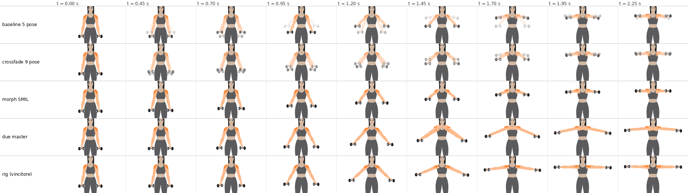
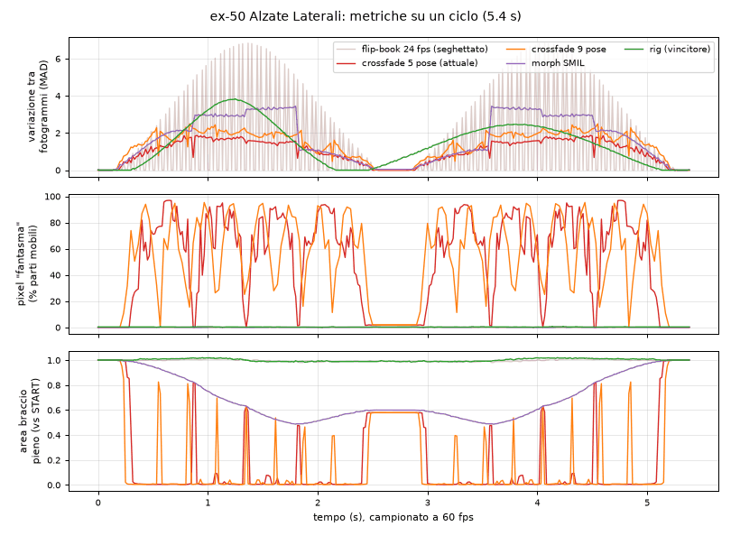
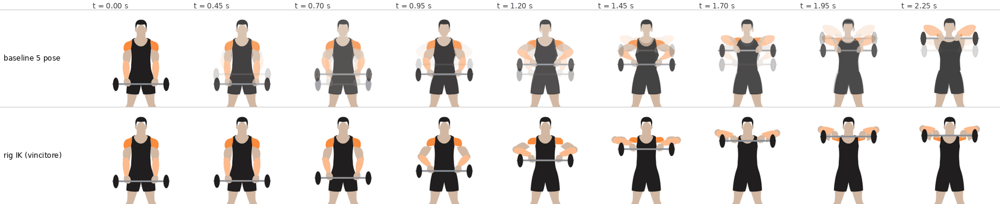

# Ricerca: animazione fluida "quasi video" dalle pose vettoriali

Obiettivo: trovare la tecnica che, partendo dai disegni vettoriali generati con Quiver (Arrow), da' il movimento piu' fluido e simile a un video, senza fantasmi, con file leggeri, senza JavaScript, compatibile con `` e con `prefers-reduced-motion`. Lavoro di ricerca e prototipi: nessun file di produzione e' stato toccato.

Materiale di prova: le immagini finite ex-50 Alzate Laterali (braccio rigido che ruota attorno alla spalla, vista frontale) ed ex-49 Tirate al Mento (braccio + avambraccio + bilanciere, vista frontale); ex-46 ed ex-47 analizzate come esempi di spinta. I disegni sono piccoli e compressi (figure di circa 60 unita' di larghezza nella bozza): servono per il confronto relativo, non per la qualita' finale.

## In breve

- **Vincitore: rig a trasformazioni ("tween") da UN solo disegno START diviso in parti.** Ogni parte mobile (braccio, avambraccio, manubrio, bilanciere, deltoide) e' un gruppo che ruota attorno al suo perno anatomico (spalla, gomito, mano) con keyframe CSS `transform`; il busto, la testa e le gambe restano fermi. Le pose intermedie sono geometria vera, non dissolvenze.
- Numeri (60 fps, Chromium): pixel "fantasma" medi **0.3%** contro **50.9%** del crossfade attuale (ex-50) e **0.4%** contro **40.7%** (ex-49); indice di scatto **0.023** contro **0.081** (ex-50) e **0.027** contro **0.152** (ex-49); braccio sempre pieno e di lunghezza costante (area 0.98-1.02 contro 0.00-1.00); file **12.8 KB** e **19.7 KB**.
- Piu' pose in crossfade non servono: con 9 pose i fantasmi restano al 52.3% e il file pesa 4 volte tanto. Il morph dei contorni toglie i fantasmi ma richiede pose coerenti (non lo sono), pesa 55-90 KB e costa il doppio di CPU. Un flip-book a 24 fps resta a scatti (indice 0.68).
- Conseguenza per le generazioni Quiver: **non servono piu' 5 pose coerenti**. Serve **1 disegno START molto dettagliato**, con i segmenti mobili come forme separate, piu' (per i movimenti a 2 o piu' segmenti) **1 posa END solo di riferimento** per angoli e ampiezza. Il dettaglio si paga una volta sola invece di 5.
- Strumento: `esercizi-bozze/prototipi-v2/rig-anim.js` (Node, senza dipendenze) genera l'SVG animato da un file "parts" e da un JSON di rig; `verifica-rig.js` controlla peso, riduzione movimento, scatti e produce il foglio di controllo.

## 1. Metodo di misura

- Render deterministici con Playwright/Chromium (`/opt/pw-browsers`): animazioni CSS messe in pausa e posizionate con `currentTime`, SMIL con `setCurrentTime`; 324 fotogrammi per ciclo (60 fps su 5.4 s), larghezza 720 px.
- **Fluidita' temporale**: differenza media assoluta tra fotogrammi consecutivi (MAD) sulla regione che si muove. Un moto continuo da' una curva liscia; i cambi improvvisi di "velocita' visiva" danno denti. Indice di scatto = media |dMAD| / media MAD; salto massimo = max |dMAD| / media MAD (oltre 0.5 lo scatto si vede).
- **Fantasmi**: quota dei pixel interni alle parti mobili con un colore che non esiste nelle pose pulite (mescolato da trasparenza). I pixel di bordo antialias sono esclusi: un colore conta come fantasma solo se non e' spiegabile come miscela di due colori puliti presenti nell'intorno 5x5.
- **Coerenza geometrica**: area dei pixel del braccio disegnato pieno (colore `#fdba8c` esatto) rispetto a START; lunghezze degli arti misurate sui contorni vettoriali dal perno della spalla.
- **Costo**: tempo del thread principale per secondo di animazione, immagine come `` 360x198 px a DPR 3, CPU rallentata 6x (traccia Chrome). Variazione tra esecuzioni circa 10%: contano i rapporti.
- **Giudizio visivo** su fogli di contatto e ingrandimenti 3x delle articolazioni.

## 2. Tecniche provate

### 2.1 Crossfade a 5 pose (attuale)

Gruppi `#f-giu`...`#f-su` in dissolvenza con opacita' complementari. Difetti misurati su ex-50: fantasmi 50.9% di media e 93% al 95 percentile; per quasi tutta la transizione nessun pixel del braccio e' pieno (area 0.00), cioe' il braccio non c'e' mai davvero tra due pose: si vedono due braccia e due manubri trasparenti. Con opacita' p e 1-p sovrapposte, dove le due pose coincidono resta il 25% di trasparenza a meta' (la "leggera perdita di opacita'" annotata nell'inventario). In ex-49 e in ex-47 anche busto e testa stanno nei gruppi: a meta' transizione la canotta nera diventa grigia (vedi `img/striscia-ex49.png`). Inoltre i disegni della bozza non sono coerenti tra loro: in ex-50 il braccio misurato dalla spalla e' lungo 37.9, 32.1, 25.3, 18.1, 22.5 unita' nelle 5 pose (1.00, 0.85, 0.67, 0.48, 0.59) e l'area cala fino al 62%: le braccia alzate sono state probabilmente compresse per stare nello spazio di circa 60 unita' assegnato a ogni figura della striscia. In ex-46 succede il contrario (braccio END circa 1.5 volte quello START).

### 2.2 Piu' pose: crossfade a 9 pose

5 pose disegnate piu' 4 pose sintetiche intermedie (contorni interpolati a meta' strada, marcate `data-synthetic="1"` nel file). Fantasmi 52.3% (nessun miglioramento), indice di scatto 0.085, file 43.4 KB. Le pose piu' vicine riducono la distanza tra le due immagini sovrapposte ma non la sovrapposizione: si vedono sempre due braccia trasparenti. Comprare piu' pose per il crossfade non conviene.

### 2.3 Tween rigido da un solo disegno

Il braccio START (un'unica forma: braccio, avambraccio, mano) ruota attorno alla spalla fino a 80 gradi con `transform: translate(perno) rotate(a) translate(-perno)`; il manubrio, annidato, contro-ruota attorno alla mano e resta orizzontale; il deltoide segue il 55% dell'angolo. Risultato: fantasmi 0.2% (solo antialias), indice di scatto 0.022, salto massimo 0.07, area del braccio 0.99-1.02, 8.9 KB.

Quanto si puo' ruotare un disegno singolo (`img/limiti-rotazione.png`):
- Con il perno al centro della testa dell'omero (circa 4.5 unita' sotto il bordo della spalla, a meta' larghezza del braccio) la rotazione resta pulita fino a 85-90 gradi.
- Con il perno troppo mediale (il punto fisso calcolato dalla bozza, vedi sotto) da circa 60 gradi la radice del braccio scavalca il petto.
- Il deltoide evidenziato non puo' ruotare rigidamente: e' disegnato a cavallo dell'articolazione (meta' sul busto, meta' sul braccio). Ruotato del 100% finisce sul collo oltre 75 gradi; fermo resta una macchia sotto il braccio alzato. Soluzione: seguire una frazione dell'angolo (55% in ex-50) e, in ex-49 dove il braccio ruota di 130 gradi, solo il 20% piu' uno schiacciamento verso l'acromion (scala 0.45, `img/deltoide-ex49.png`).
- Il braccio ruotato tiene la sua lunghezza: in alto la figura e' piu' larga della bozza (apertura braccia circa uguale all'altezza, anatomicamente corretta), quindi il riquadro deve contenere tutta la corsa.

Stima automatica dei perni: un adattamento di similitudine (Procrustes) tra il braccio START e quello di ogni altra posa da' il punto fisso del moto; per ex-50 cade sempre sulla spalla entro circa 3 unita' (START->END: 870.3, 110.0 a sinistra; 884.8, 110.1 a destra; rotazione 82 gradi). Con bozze incoerenti (scala 0.70 tra le pose) il punto risulta un po' troppo mediale: va usato come primo valore e corretto a occhio.

### 2.4 Due disegni master (START + END) con dissolvenza a meta'

Strato A = START ruotato in avanti, strato B = END ruotato all'indietro, cosi' a meta' corsa coincidono; B entra in dissolvenza SOPRA A opaco (niente perdita di trasparenza) e poi A sparisce. Funziona solo se i due disegni hanno le stesse proporzioni. Con la bozza d di ex-50 il braccio END e' lungo il 57% di quello START e parte dal collo: anche allungato di 1.7 volte lungo il suo asse, al cambio si vede un doppio braccio (fantasmi 34% al 95 percentile, area fino a 1.89) e in alto compare un cuneo di pelle sul petto. Utile solo per piccoli dettagli che cambiano forma (orientamento della mano nell'Arnold press, forma del deltoide contratto) e solo con disegni proporzionati.

### 2.5 Morph dei tracciati (`d` animato)

Fattibilita' diretta: no. Le parti corrispondenti non hanno la stessa struttura di comandi (braccio sinistro di ex-50: 13, 11, 11, 8, 8 segmenti, con `C` e `L` mescolati; ex-49: da 17 a 20 elementi per posa con ruoli che cambiano, per esempio in END il colore `#fdba8c`, che in START e' l'avambraccio, diventa il braccio e l'avambraccio non c'e' piu'; ex-47: le barre dei manubri mancano in una posa; ex-46: dal 25% in poi braccio, testa e spalla sono un'unica forma). Il `d` come proprieta' CSS animabile non e' supportato da Safari, quindi servirebbe SMIL.

Fattibilita' con normalizzazione (solo ex-50, dove le parti corrispondono): contorni ricampionati con lo stesso numero di punti, allineati e ritrasformati in curve con la stessa struttura, animati con `<animate attributeName="d">`. Fantasmi 0.1%, ma il braccio si accorcia come nella bozza (area 0.49-1.00), velocita' a strappi dove le pose disegnate sono irregolari (salto 0.64), 55-90 KB solo per 2 braccia e 2 deltoidi, CPU circa doppia rispetto al crossfade. Scartato.

### 2.6 Ibrido: rig + movimenti secondari + tempo

Su ex-50: tween rigido piu' (a) spalle che salgono di 0.9 unita' nell'ultima parte della salita (rotazione della scapola), (b) deltoide che si contrae (piu' corto e largo del 10%), (c) respiro (busto scalato dello 0.8% attorno alla vita, cosi' alla cintura non si apre nessuna fessura), (d) tempo asimmetrico: pausa in basso 0.6 s, salita 1.8 s, pausa in alto 0.3 s, discesa 2.6 s (percentuali 6/40/46/95 del ciclo da 5.4 s), easing quasi a jerk minimo `cubic-bezier(.47,0,.53,1)` in salita e `(.42,0,.58,1)` in discesa. Fantasmi 0.4%, indice 0.027.

Cosa da' davvero "effetto video", alla dimensione dell'app (circa 1.5 px CSS per unita'):
1. Togliere la dissolvenza (moto geometrico continuo a 60 fps): e' il salto di qualita'.
2. Easing e tempo realistici (salita piu' veloce della discesa, pause brevi): ben visibile.
3. Archi naturali: vengono gratis dalla rotazione attorno ai perni.
4. Spalle che salgono (circa 1.3 px) e muscolo che si contrae (circa 1.4 px): piccoli ma percepibili, danno vita.
5. Respiro: 0.3 unita' alla testa, circa 0.4 px, impercettibile. Tolto dallo strumento.

### 2.7 Altre prove

- **Flip-book a 24 fps** (gli stessi disegni perfetti del rig, cambiati a scatti con SMIL `calcMode="discrete"`): indice di scatto 0.68 (30 volte il rig), salto 1.70. A 24 fps si vede a scatti; un vero flip-book disegnato richiederebbe 65 disegni coerenti per mezzo ciclo, impossibile con Quiver.
- **Catena a due segmenti (ex-49)**: prima prova con cinematica inversa 2D pura: scatto visibile (salto 1.47) perche' con la presa larga come le spalle il polso, visto di fronte, passa sopra la spalla e la soluzione del gomito cambia ramo. Soluzione adottata: il braccio ruota con una curva di easing fino all'angolo finale calcolato con la cinematica inversa (dove e' ben condizionata) e l'avambraccio "punta" il polso, allungandosi o accorciandosi lungo il proprio asse (fattore 0.75-1.05: lo scorcio dell'avambraccio che viene verso chi guarda). Con keyframe interpolati linearmente restava un andamento a gradini (salto 0.49); con keyframe a passi uguali di avanzamento e su ogni segmento il pezzo esatto della curva di easing (suddivisione di de Casteljau) il salto scende a 0.10.
- **Coperture dei giunti**: un cerchio color pelle al gomito, sotto l'avambraccio, nasconde lo spigolo quando il gomito si piega.

## 3. Tabella delle misure

Costo CPU dal run unico finale (vedi nota sotto la tabella).

| Prototipo | KB | Fantasmi medi | Fantasmi p95 | Indice di scatto | Salto max | Braccio pieno | CPU ms/s |
|---|---|---|---|---|---|---|---|
| ex-50 crossfade 5 pose (attuale) | 11.3 | 50.9% | 93.3% | 0.081 | 0.96 | 0.00-1.00 | 229 |
| ex-50 crossfade 9 pose | 43.4 | 52.3% | 92.9% | 0.085 | 0.97 | 0.00-1.00 | 270 |
| ex-50 morph SMIL | 88.2 | 0.1% | 0.4% | 0.034 | 0.64 | 0.49-1.00 | 460 |
| ex-50 flip-book 24 fps | 20.2 | 0.1% | 0.1% | 0.682 | 1.70 | 0.98-1.01 | 192 |
| ex-50 due master | 12.9 | 2.9% | 34.3% | 0.045 | 1.96 | 1.00-1.89 | 382 |
| ex-50 tween rigido | 8.9 | 0.2% | 0.4% | 0.022 | 0.07 | 0.99-1.02 | 326 |
| ex-50 ibrido | 10.7 | 0.4% | 0.5% | 0.027 | 0.10 | 0.98-1.02 | 326 |
| **ex-50 rig (strumento)** | **12.8** | **0.3%** | **0.5%** | **0.023** | **0.08** | **0.98-1.02** | **326** |
| ex-49 crossfade 5 pose (attuale) | 16.1 | 40.7% | 84.0% | 0.152 | 1.51 | 0.00-1.29 | 236 |
| ex-49 rig (prototipo) | 37.1 | 0.2% | 0.5% | 0.027 | 0.10 | 0.57-1.00 | 308 |
| **ex-49 rig (strumento)** | **19.7** | **0.4%** | **0.8%** | **0.027** | **0.10** | **0.55-1.00** | **333** |

Note: in ex-49 l'area dell'avambraccio cala per scelta (scorcio 0.75 in alto e mani davanti), non per incoerenza: i segmenti rigidi hanno lunghezza costante per costruzione. CPU: immagine statica circa 1 ms/s; il rig costa piu' del crossfade perche' a ogni fotogramma cambia la geometria (layout e ridisegno dell'SVG): +42% in questo run, +20-55% su tre run. Resta comunque circa 5.5 ms per fotogramma con CPU rallentata 6 volte, dentro il budget di 16.7 ms anche su un telefono economico. Il crossfade con 9 pose costa il 18% in piu' di quello a 5, il morph il doppio; il flip-book costa meno solo perche' cambia 24 volte al secondo invece di 60.

Altri controlli:
- Usato come `` (come in `js/dati/disegni-esercizi.js`) il rig si anima normalmente (niente script richiesti; CSS e SMIL funzionano dentro ``).
- Riduzione movimento: con la preferenza di sistema attiva (prova con Chromium `--force-prefers-reduced-motion`) tutti i file restano fermi sulla posa START anche dentro ``. Attenzione per i test: l'emulazione `reducedMotion` di Playwright vale per la pagina ma non arriva dentro le immagini SVG; `verifica-rig.js` apre quindi l'SVG come documento.
- Giunzione del ciclo: differenza 0 tra fine e inizio.

## 4. Vincitore e perche'

Rig a trasformazioni da un solo disegno START (ex-50: `ex-50-rig.svg`; ex-49: `ex-49-rig.svg`), con:
- perni alle articolazioni, catene annidate (manubrio dentro il braccio, avambraccio dentro il braccio);
- per due segmenti: braccio con curva di easing + avambraccio che punta il polso con allungamento limitato (scorcio);
- tutti i canali funzione di un unico avanzamento con easing esatto (2 keyframe per i canali lineari, keyframe densi con curve suddivise solo dove serve);
- tempo realistico (6/40/46/95) e pochi movimenti secondari utili (spalle, contrazione del muscolo);
- busto, testa e gambe statici (mai in dissolvenza).

E' l'unica tecnica che ha insieme: zero fantasmi, moto continuo a frequenza piena dello schermo, arti di misura costante, file piccolo (13-20 KB per disegni di questo dettaglio), nessun JavaScript, `` e riduzione movimento funzionanti. Il dettaglio del disegno si paga una volta: oggi ogni posa di ex-49 occupa 2.4-2.8 KB e c'e' cinque volte; con un disegno quattro volte piu' ricco il crossfade arriverebbe a circa 55-60 KB, il rig a circa 30-35 KB (circa 20 KB di disegno piu' 10-15 KB di keyframe).

Limiti: le parti sono rigide (niente pieghe, muscoli che si deformano, pronazione del polso, busto che si flette); i trucchi ammessi sono piccoli (schiacciamento, allungamento lungo l'asse del 5-8% al massimo, frazioni di rotazione).

## 5. Cosa devono avere i disegni Quiver (per chi scrive i prompt)

Requisiti generali del disegno master (posa START):
1. **Una sola figura per immagine**, grande e centrata, posa START dell'esercizio, sfondo vuoto, niente testo o etichette, niente ombre a terra multiple. (Probabile causa del braccio END lungo il 57% in ex-50: a braccia tese la figura sarebbe larga circa 100 unita', ma nella striscia a 5 figure ognuna aveva circa 60 unita'.)
2. **Vista scelta sul piano del movimento**: le parti che si muovono devono restare parallele al foglio. Di fronte: alzate laterali, tirate al mento, spinte con manubri a gomiti larghi, lat machine, abductor. Di lato: alzate frontali, curl, tricipiti, rematori, squat, stacchi, affondi, push-up, leg extension/curl, calf, hip thrust, crunch. Da evitare le viste in cui un arto va verso chi guarda.
3. **Ogni segmento mobile e' una forma separata e chiusa**: braccio, avambraccio, mano (o pugno con l'attrezzo), coscia, gamba, piede, busto, testa; attrezzo separato (manubrio, bilanciere, maniglia, leva, cavo, pacco pesi). Nessuna forma unica che copra due segmenti o un segmento piu' il busto (ex-46: braccio e petto in un'unica forma; ex-47: braccio e avambraccio uniti; ex-49 invece li ha separati ed e' stato animabile subito).
4. **Articolazioni leggibili**: estremita' arrotondate a spalla, gomito, polso, anca, ginocchio; i segmenti si sovrappongono un po' all'articolazione (l'estremita' del segmento figlio passa sotto quello padre).
5. **Evidenziazioni muscolari dentro un solo segmento** (bicipite sul braccio, quadricipite sulla coscia); il deltoide solo sulla cupola della spalla, non a cavallo dell'articolazione.
6. **Arti non sovrapposti al busto nella posa START** se possibile (braccia leggermente staccate dai fianchi), niente spalline o maniche che attraversano un'articolazione che si muove.
7. **Proporzioni anatomiche costanti** (apertura delle braccia circa uguale all'altezza) e spazio vuoto sufficiente attorno alla figura per tutta la corsa (alzate laterali: riquadro largo quanto alto).
8. **Colori piatti dalla palette**, nessun gradiente; niente ombreggiature direzionali sugli arti che ruotano (l'ombra ruoterebbe con l'arto).
9. **Attrezzo impugnato correttamente nella posa START**, con orientamento che non deve cambiare durante il movimento.

La posa END (seconda generazione) serve solo come **riferimento** per angoli e ampiezza (e per controllare l'anatomia): non viene usata come disegno, quindi puo' essere meno curata e non deve essere identica nello stile.

## 6. Pose da comprare per tipo di movimento

| Tipo | Esempi | Disegni Quiver | Rig |
|---|---|---|---|
| (i) Rotazione rigida attorno a un'articolazione | alzate laterali e frontali, slanci, abductor, kickback, leg raise, calf raise | 1 master START (dettagliato) + 1 END di riferimento facoltativo | 1 perno per arto, attrezzo annidato che contro-ruota se deve restare orizzontale |
| (ii) Flessione a due segmenti | curl, spinte, rematori, tirate, tricipiti, lat machine, leg extension/curl | 1 master START + 1 END di riferimento (necessario per l'angolo finale) | braccio con `ik2` (angolo finale da cinematica inversa), avambraccio con `aim` verso il polso, attrezzo in traslazione |
| (iii) Corpo intero o busto | squat, stacco, affondi, push-up, hip thrust, ponte, good morning, crunch | 1 master START + 1 END di riferimento; + 1 MID se il busto si flette (crunch) | catena di 3-5 segmenti rigidi (busto, coscia, gamba, braccio); per il busto che si flette 2-3 pezzi di busto o un piccolo scambio di dettaglio |
| (iv) Macchine e cavi | leg press, lat machine, pulley, croci ai cavi, pectoral, macchine a leva | 1 master START con macchina completa e parti mobili separate + 1 END di riferimento | leva che ruota attorno al perno della macchina, cavo come segmento con `aim` dalla puleggia alla maniglia, pacco pesi in traslazione |

In pratica: 1-2 prompt per esercizio (ognuno con le sue 4 varianti) invece di 1 prompt con 5 pose coerenti; i crediti spesi restano simili ma ogni figura ha tutto lo spazio dell'immagine per il dettaglio.

## 7. Strumento, flusso di lavoro e stima dei tempi

File (in `esercizi-bozze/prototipi-v2/`):
- `rig-anim.js`: `node rig-anim.js rig/ex-50-rig.json -o ex-50-rig.svg`. Legge il file "parts" (gruppi `<g id>` nelle coordinate della posa START) e il JSON di rig (perni, rotazioni finali, `ik2`, `aim`, traslazioni, scale, finestre di avanzamento, timeline). Scrive un SVG con `viewBox="0 0 W H"` (coordinate ribasate, cosi' `transform-origin` non e' ambiguo tra i browser), classi e keyframe con prefisso (sicuro anche se l'SVG viene incollato inline), `@media (prefers-reduced-motion:reduce)`. Stampa angoli e allungamenti calcolati.
- `verifica-rig.js`: `node verifica-rig.js file.svg --sheet foglio.png`. Controlla peso (<= 60 KB), viewBox 0 0, assenza di crossfade, riduzione movimento uguale alla posa START, giunzione del ciclo, indice di scatto e salto massimo (oltre 0.5 = scatto), e salva il foglio di controllo con 12 fotogrammi. Usa `playwright-core` come i test del repo.
- Esempi: `rig/ex-50-parts.svg` + `rig/ex-50-rig.json`, `rig/ex-49-parts.svg` + `rig/ex-49-rig.json`.

Flusso per un esercizio:
1. Pulizia del master START (palette, via sfondi e decorazioni) e divisione in parti con id (`busto`, `bracS`, `avambS`, `manubrioS`...), ordine di disegno corretto, coperture dei giunti dove servono.
2. Rig JSON: perni dalle forme (centro della testa dell'omero, gomito, polso); angoli o bersagli finali letti dalla posa END di riferimento; timeline.
3. Generazione, verifica, controllo a occhio del foglio e degli ingrandimenti delle articolazioni alla massima ampiezza; ritocchi e nuova generazione.

Stima: (i) 1-1.5 ore; (ii) 1.5-2 ore; (iii) e (iv) 2-4 ore. La parte meccanica (keyframe, easing esatto, cinematica inversa, ribasamento, prefissi, riduzione movimento, controlli) e' gia' automatica. Restano manuali: la divisione in parti, la scelta dei perni (la stima Procrustes da START+END aiuta solo se le pose sono coerenti), il trattamento delle forme a cavallo dei giunti, eventuali cambi di ordine di disegno. Se Quiver unisce due segmenti in una forma, si puo' tagliarla con due `clipPath` (semipiani passanti per il giunto) e coprire il taglio con un cerchio al giunto: costa 30-60 minuti in piu' e lascia piu' rischio di cuciture visibili, quindi meglio chiederlo nel prompt.

## 8. Errori da controllare (lista per l'agente che costruisce)

1. Perno nel posto sbagliato: la radice dell'arto scivola o si apre un vuoto alla spalla. Controllare ingrandito alla massima ampiezza.
2. Forma a cavallo di un giunto (deltoide, braccio unito al busto): finisce sul collo o sotto l'ascella. Frazione di rotazione piu' schiacciamento, taglio, o cerchio di copertura.
3. Vuoto al gomito o al ginocchio quando si piega: cerchio del colore del segmento padre sotto il segmento figlio.
4. Cinematica inversa vicino alla singolarita' (polso che passa sopra la spalla nella proiezione): il gomito cambia ramo e scatta. Usare `ik2` solo per l'angolo finale e `aim` per l'avambraccio; `verifica-rig.js` lo segnala con il salto massimo.
5. Angolo che fa il giro lungo tra due keyframe (179 -> -179): rotazione all'indietro di quasi un giro. Lo strumento ruota sempre dal lato esterno; con angoli scritti a mano, srotolarli.
6. Allungamento dell'avambraccio oltre il 5-8%: si vede. Ridurre la corsa o lo scorcio.
7. Riquadro troppo piccolo: con l'arto a lunghezza costante la posa END puo' uscire dal viewBox della bozza.
8. Cambio di ordine di disegno durante il movimento (braccio che passa davanti alla testa): scegliere un'altra vista o fare un cambio di strato breve nel punto in cui le due copie coincidono.
9. Movimento fuori dal piano (polso che ruota, gomiti verso chi guarda): solo trucchi limitati (allungamento lungo l'asse, piccolo scambio di dettaglio); meglio cambiare vista.
10. Riduzione movimento: con `animation:none` deve restare la posa START (controllo automatico); provare anche con `--force-prefers-reduced-motion` in ``.
11. Safari/iOS: tenere il viewBox a 0 0 (lo fa lo strumento) e provare almeno un file su un iPhone vero prima di estendere il metodo.
12. Prestazioni: al massimo una decina di gruppi animati e niente filtri; il costo cresce con il numero di tracciati ridisegnati.

## 9. Rischi e limiti

- Prove solo su Chromium (Playwright); Safari e Firefox non erano disponibili. Il punto delicato e' `transform-box`/`transform-origin` sugli elementi SVG: mitigato con il viewBox a 0 0 e l'origine 0 0.
- Non e' noto quanto Quiver rispetti la richiesta di segmenti separati: va provato con il primo prompt; il piano B e' il taglio con `clipPath`.
- Le parti rigide non mostrano deformazioni (pelle, stoffa, muscoli); il risultato e' "cartone animato a ritaglio" fluido, non un video fotografico.
- Il rig costa circa il 20-55% di CPU in piu' del crossfade (sempre entro il budget per fotogramma con un'immagine animata a schermo).
- I prototipi usano i disegni piccoli attuali: la qualita' assoluta dipendera' dal nuovo master dettagliato.

## 10. Miglioramenti subito, senza nuove generazioni

- `ex-50-rig.svg` ed `ex-49-rig.svg` usano gli stessi disegni delle immagini pubblicate e potrebbero sostituirle dopo una revisione visiva (nomi di file e collegamenti in `js/` restano da decidere: qui non e' stato toccato nulla).
- Per le immagini a 5 pose che restano in crossfade: portare fuori dai gruppi animati busto, canotta e testa (oggi dentro in ex-47 ed ex-49), cosi' a meta' transizione non diventano grigi.

## 11. File prodotti

- Prototipi ex-50: `esercizi-bozze/prototipi-v2/ex-50-baseline.svg`, `ex-50-crossfade-9.svg`, `ex-50-morph-smil.svg`, `ex-50-flipbook-24.svg`, `ex-50-tween-2master.svg`, `ex-50-tween-rigid.svg`, `ex-50-hybrid.svg`, `ex-50-rig.svg` (vincitore, generato dallo strumento).
- Prototipi ex-49: `ex-49-baseline.svg`, `ex-49-tween-ik.svg`, `ex-49-rig.svg` (vincitore, generato dallo strumento).
- Confronto affiancato: `esercizi-bozze/prototipi-v2/confronto.html` (animazioni dal vivo; servita via http permette rallentatore e scorrimento sincronizzati).
- Immagini: `esercizi-bozze/prototipi-v2/img/striscia-ex50.png`, `striscia-ex49.png`, `metriche-ex50.png`, `metriche-ex49.png`, `limiti-rotazione.png`, `deltoide-ex49.png`.
- Strumenti: `esercizi-bozze/prototipi-v2/rig-anim.js`, `verifica-rig.js`, `rig/` (parts e JSON di esempio).
- Script di ricerca (misure e costruzione dei prototipi, richiedono Python con numpy, scipy, pillow, svgelements, matplotlib): `esercizi-bozze/prototipi-v2/strumenti-ricerca/`.

